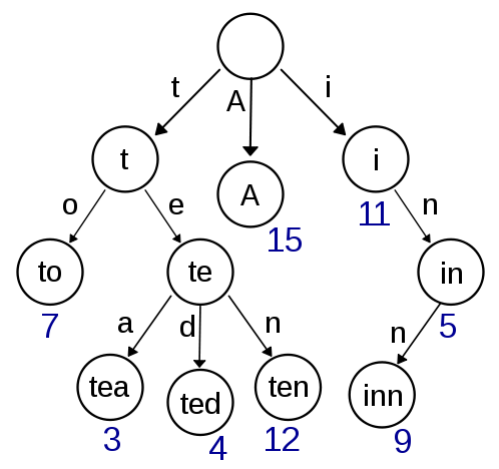

# 13.6 字典树

字典树（Trie）用于判断字符串是否存在或者是否具有某种字符串前缀。

<figure>
  <span style={{ display: 'block', width: '50%', margin: '0 auto' }}>
    
  </span>
  <figcaption style={{ textAlign: 'center' }}>图 13.1: 字典树，存储了单词 A、to、tea、ted、ten、i、in 和 inn，以及它们的频率</figcaption>
</figure>

为什么需要用字典树解决这类问题呢？假如我们有一个储存了近万个单词的字典，即使我们使用哈希，在其中搜索一个单词的实际开销也是非常大的，且无法轻易支持搜索单词前缀。然而由于一个英文单词的长度 n 通常在 10 以内，如果我们使用字典树，则可以在 $O(n)$——近似 $O(1)$ 的时间内完成搜索，且额外开销非常小。

## [208. Implement Trie (Prefix Tree)](https://leetcode.com/problems/implement-trie-prefix-tree/)

### 题目描述

尝试建立一个字典树，支持快速插入单词、查找单词、查找单词前缀的功能。

### 输入输出样例

以下是数据结构的调用样例。

```
Trie trie = new Trie();
trie.insert("apple");
trie.search("apple"); // true
trie.search("app"); // false
trie.startsWith("app"); // true
trie.insert("app");
trie.search("app"); // true
```

### 题解

以下是字典树的典型实现方法。

<Tabs>
<TabItem value="cpp" label="C++">

```cpp
struct TrieNode {
    bool word_ends;
    vector<TrieNode*> children;
    TrieNode() : word_ends(false), children(26, nullptr) {}
};

class Trie {
   public:
    Trie() : root_(new TrieNode()) {}

    void insert(string word) {
        TrieNode* node = root_;
        for (char c : word) {
            int pos = c - ’a’;
            if (node->children[pos] == nullptr) {
                node->children[pos] = new TrieNode();
            }
            node = node->children[pos];
        }
        node->word_ends = true;
    }

    bool search(string word) {
        TrieNode* node = root_;
        for (char c : word) {
            if (node == nullptr) {
                break;
            }
            node = node->children[c - ’a’];
        }
        return node != nullptr && node->word_ends;
    }

    bool startsWith(string prefix) {
        TrieNode* node = root_;
        for (char c : prefix) {
            if (node == nullptr) {
                break;
            }
            node = node->children[c - ’a’];
        }
        return node != nullptr;
    }

   private:
    TrieNode* root_;
};
```

</TabItem>
<TabItem value="py" label="Python">

```py
class TrieNode:
    def __init__(self):
        self.word_ends = False
        self.children = [None] * 26

class Trie:
    def __init__(self):
        self.root = TrieNode()

    def insert(self, word: str) -> None:
        node = self.root
        for c in word:
            pos = ord(c) - ord("a")
            if node.children[pos] is None:
                node.children[pos] = TrieNode()
            node = node.children[pos]
        node.word_ends = True

    def search(self, word: str) -> bool:
        node = self.root
        for c in word:
            if node is None:
                break
            node = node.children[ord(c) - ord("a")]
        return node is not None and node.word_ends

    def startsWith(self, prefix: str) -> bool:
        node = self.root
        for c in prefix:
            if node is None:
                break
            node = node.children[ord(c) - ord("a")]
        return node is not None

```

</TabItem>

</Tabs>