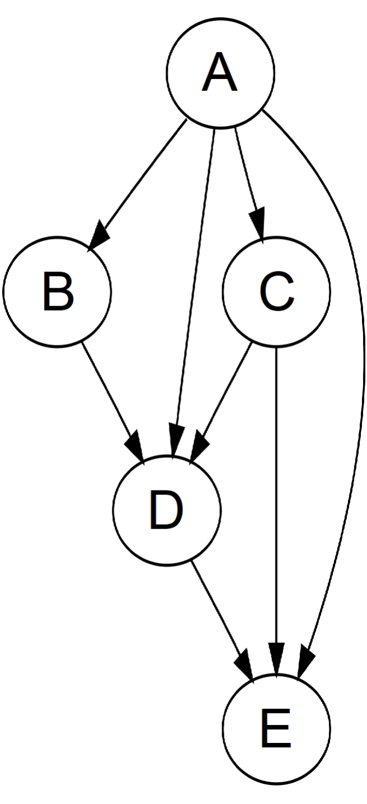

# 14.1 数据结构介绍

作为指针三剑客之三，图是树的升级版。`图`通常分为有向（directed）或无向（undirected），有循环（cyclic）或无循环（acyclic），所有节点相连（connected）或不相连（disconnected）。树即是一个相连的无向无环图，而另一种很常见的图是`有向无环图`（Directed Acyclic Graph，DAG）。

<figure>
  
    
  
  <figcaption style={{ textAlign: 'center' }}>图 14.1: 有向无环图样例</figcaption>
</figure>

图通常有两种表示方法。假设图中一共有 n 个节点、m 条边。第一种表示方法是`邻接矩阵`（adjacency matrix）：我们可以建立一个 n × n 的矩阵 G，如果第 i 个节点连向第 j 个节点，则 G[i][j] = 1，反之为 0；如果图是无向的，则这个矩阵一定是对称矩阵，即 G[i][j] = G[j][i]。第二种表示方法是`邻接链表`（adjacency list）：我们可以建立一个大小为 n 的数组，每个位置 i 储存一个数组或者链表，表示第 i 个节点连向的其它节点。邻接矩阵空间开销比邻接链表大，但是邻接链表不支持快速查找 i 和 j 是否相连，因此两种表示方法可以根据题目需要适当选择。除此之外，我们也可以直接用一个 m × 2 的矩阵储存所有的边。