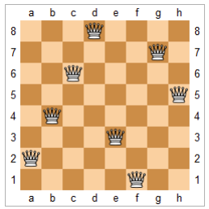

# 5.3 回溯法

`回溯法`（backtracking）是优先搜索的一种特殊情况，又称为试探法，常用于需要记录节点状态的深度优先搜索。通常来说，排列、组合、选择类问题使用回溯法比较方便。

顾名思义，回溯法的核心是回溯。在搜索到某一节点的时候，如果我们发现目前的节点（及其子节点）并不是需求目标时，我们回退到原来的节点继续搜索，并且`把在目前节点修改的状态还原`。这样的好处是我们可以始终只对图的总状态进行修改，而非每次遍历时新建一个图来储存状态。在具体的写法上，它与普通的深度优先搜索一样，都有 [修改当前节点状态]→[递归子节点] 的步骤，只是多了回溯的步骤，变成了 [修改当前节点状态]→[递归子节点]→[回改当前节点状态]。

没有接触过回溯法的读者可能会不明白我在讲什么，这也完全正常，希望以下几道题可以让您理解回溯法。如果还是不明白，可以记住两个小诀窍，`一是按引用传状态，二是所有的状态修改在递归完成后回改`。

回溯法修改一般有两种情况，一种是修改最后一位输出，比如排列组合；一种是修改访问标记，比如矩阵里搜字符串。

## [46. Permutations](https://leetcode.com/problems/permutations/)

### 题目描述

给定一个无重复数字的整数数组，求其所有的排列方式。

### 输入输出样例

输入是一个一维整数数组，输出是一个二维数组，表示输入数组的所有排列方式。

```
Input: [1,2,3]
Output: [[1,2,3], [1,3,2], [2,1,3], [2,3,1], [3,2,1], [3,1,2]]
```

可以以任意顺序输出，只要包含了所有排列方式即可。

### 题解

怎样输出所有的排列方式呢？对于每一个当前位置 i，我们可以将其于之后的任意位置交换，然后继续处理位置 i+1，直到处理到最后一位。为了防止我们每此遍历时都要新建一个子数组储存位置 i 之前已经交换好的数字，我们可以利用回溯法，只对原数组进行修改，在递归完成后再修改回来。

我们以样例 [1,2,3] 为例，按照这种方法，我们输出的数组顺序为 [[1,2,3], [1,3,2], [2,1,3], [2,3,1],[3,2,1], [3,1,2]]，可以看到所有的排列在这个算法中都被考虑到了。

<Tabs>
<TabItem value="cpp" label="C++">

```cpp
// 辅函数。
void backtracking(vector<int> &nums, int level,
                  vector<vector<int>> &permutations) {
    if (level == nums.size() - 1) {
        permutations.push_back(nums);
        return;
    }
    for (int i = level; i < nums.size(); ++i) {
        swap(nums[i], nums[level]);  // 修改当前节点状态
        backtracking(nums, level + 1, permutations);  // 递归子节点
        swap(nums[i], nums[level]);  // 回改当前节点状态
    }
}
// 主函数。
vector<vector<int>> permute(vector<int> &nums) {
    vector<vector<int>> permutations;
    backtracking(nums, 0, permutations);
    return permutations;
}
```

</TabItem>
<TabItem value="py" label="Python">

```py
# 辅函数。
def backtracking(nums: List[int], level: int, permutations: List[List[int]]):
    if level == len(nums) - 1:
        permutations.append(nums[:]) # int为基本类型，可以浅拷贝
        return
    for i in range(level, len(nums)):
        nums[i], nums[level] = nums[level], nums[i] # 修改当前节点状态
        backtracking(nums, level + 1, permutations) # 递归子节点
        nums[i], nums[level] = nums[level], nums[i] # 回改当前节点状态

# 主函数。
def permute(nums: List[int]) -> List[List[int]]:
    permutations = []
    backtracking(nums, 0, permutations)
    return permutations
```

</TabItem>

</Tabs>

## [77. Combinations](https://leetcode.com/problems/combinations/)

### 题目描述

给定一个整数 n 和一个整数 k，求在 1 到 n 中选取 k 个数字的所有组合方法。

### 输入输出样例

输入是两个正整数 n 和 k，输出是一个二维数组，表示所有组合方式。

```
Input: n = 4, k = 2
Output: [[2,4], [3,4], [2,3], [1,2], [1,3], [1,4]]
```

这里二维数组的每个维度都可以以任意顺序输出。

### 题解

类似于排列问题，我们也可以进行回溯。排列回溯的是交换的位置，而组合回溯的是是否把当前的数字加入结果中。

<Tabs>
<TabItem value="cpp" label="C++">

```cpp
// 辅函数。
void backtracking(vector<vector<int>>& combinations, vector<int>& pick, int pos,
                  int n, int k) {
    if (pick.size() == k) {
        combinations.push_back(pick);
        return;
    }
    for (int i = pos; i <= n; ++i) {
        pick.push_back(i);  // 修改当前节点状态
        backtracking(combinations, pick, i + 1, n, k);  // 递归子节点
        pick.pop_back();  // 回改当前节点状态
    }
}

// 主函数。
vector<vector<int>> combine(int n, int k) {
    vector<vector<int>> combinations;
    vector<int> pick;
    backtracking(combinations, pick, 1, n, k);
    return combinations;
}
```

</TabItem>
<TabItem value="py" label="Python">

```py
# 辅函数。
def backtracking(
    combinations: List[List[int]], pick: List[int], pos: int, n: int, k: int
):
    if len(pick) == k:
        combinations.append(pick[:]) # int为基本类型，可以浅拷贝
        return
    for i in range(pos, n + 1):
        pick.append(i) # 修改当前节点状态
        backtracking(combinations, pick, i + 1, n, k) # 递归子节点
        pick.pop() # 回改当前节点状态

# 主函数。
def combine(n: int, k: int) -> List[List[int]]:
    combinations = []
    pick = []
    backtracking(combinations, pick, 1, n, k)
    return combinations
```

</TabItem>

</Tabs>

## [79. Word Search](https://leetcode.com/problems/word-search/)

### 题目描述

给定一个字母矩阵，所有的字母都与上下左右四个方向上的字母相连。给定一个字符串，求字符串能不能在字母矩阵中寻找到。

### 输入输出样例

输入是一个二维字符数组和一个字符串，输出是一个布尔值，表示字符串是否可以被寻找到。

```
Input: word = "ABCCED", board =
[[’A’,’B’,’C’,’E’],
 [’S’,’F’,’C’,’S’],
 [’A’,’D’,’E’,’E’]]
Output: true
```

从左上角的’A’ 开始，我们可以先向右、再向下、最后向左，找到连续的"ABCCED"。

### 题解

不同于排列组合问题，本题采用的并不是修改输出方式，而是修改访问标记。在我们对任意位置进行深度优先搜索时，我们先标记当前位置为已访问，以避免重复遍历（如防止向右搜索后又向左返回）；在所有的可能都搜索完成后，再回改当前位置为未访问，防止干扰其它位置搜索到当前位置。使用回溯法时，我们可以只对一个二维的访问矩阵进行修改，而不用把每次的搜索状态作为一个新对象传入递归函数中。


<Tabs>
<TabItem value="cpp" label="C++">

```cpp
// 辅函数。
bool backtracking(vector<vector<char>>& board, string& word,
                  vector<vector<bool>>& visited, int i, int j, int word_pos) {
    if (i < 0 || i >= board.size() || j < 0 || j >= board[0].size() ||
        visited[i][j] || board[i][j] != word[word_pos]) {
        return false;
    }
    if (word_pos == word.size() - 1) {
        return true;
    }
    visited[i][j] = true;  // 修改当前节点状态
    if (backtracking(board, word, visited, i + 1, j, word_pos + 1) ||
        backtracking(board, word, visited, i - 1, j, word_pos + 1) ||
        backtracking(board, word, visited, i, j + 1, word_pos + 1) ||
        backtracking(board, word, visited, i, j - 1, word_pos + 1)) {
        return true;  // 递归子节点
    }
    visited[i][j] = false;  // 回改当前节点状态
    return false;
}

// 主函数。
bool exist(vector<vector<char>>& board, string word) {
    int m = board.size(), n = board[0].size();
    vector<vector<bool>> visited(m, vector<bool>(n, false));
    for (int i = 0; i < m; ++i) {
        for (int j = 0; j < n; ++j) {
            if (backtracking(board, word, visited, i, j, 0)) {
                return true;
            }
        }
    }
    return false;
}
```

</TabItem>
<TabItem value="py" label="Python">

```py
# 辅函数。
def backtracking(board: List[List[str]], word: str,
                visited: List[List[bool]], i: int, j: int, word_pos: int):
    if (i < 0 or i >= len(board) or j < 0 or j >= len(board[0])
        or visited[i][j] or board[i][j] != word[word_pos]):
        return False
    if word_pos == len(word) - 1:
        return True
    visited[i][j] = True # 修改当前节点状态
    if (backtracking(board, word, visited, i + 1, j, word_pos + 1) or
        backtracking(board, word, visited, i - 1, j, word_pos + 1) or
        backtracking(board, word, visited, i, j + 1, word_pos + 1) or
        backtracking(board, word, visited, i, j - 1, word_pos + 1)):
        return True # 递归子节点
    visited[i][j] = False # 回改当前节点状态
    return False

# 主函数。
def exist(board: List[List[str]], word: str) -> bool:
    m, n = len(board), len(board[0])
    visited = [[False for _ in range(n)] for _ in range(m)]
    return any([
        backtracking(board, word, visited, i, j, 0)
        for i in range(m) for j in range(n)
     ])
```

</TabItem>

</Tabs>

## [51. N-Queens](https://leetcode.com/problems/n-queens/)

### 题目描述

给定一个大小为 n 的正方形国际象棋棋盘，求有多少种方式可以放置 n 个皇后并使得她们互不攻击，即每一行、列、左斜、右斜最多只有一个皇后。

<figure>

<figcaption>题目 51 - 八皇后的一种解法</figcaption>
</figure>

### 输入输出样例

输入是一个整数 n，输出是一个二维字符串数组，表示所有的棋盘表示方法。

```
Input: 4
Output: [
 [".Q..", // Solution 1
  "...Q",
  "Q...",
  "..Q."],
 ["..Q.", // Solution 2
  "Q...",
  "...Q",
  ".Q.."]
]
```

在这个样例中，点代表空白位置，Q 代表皇后。

### 题解

类似于在矩阵中寻找字符串，本题也是通过修改状态矩阵来进行回溯。不同的是，我们需要对每一行、列、左斜、右斜建立访问数组，来记录它们是否存在皇后。这里如果我们通过对每一行/列遍历来插入皇后，我们就不需要对行/列建立访问数组了。

<Tabs>
<TabItem value="cpp" label="C++">

```cpp
// 辅函数。
void backtracking(vector<vector<string>> &solutions, vector<string> &board,
                  vector<bool> &column, vector<bool> &ldiag,
                  vector<bool> &rdiag, int row) {
    int n = board.size();
    if (row == n) {
        solutions.push_back(board);
        return;
    }
    for (int i = 0; i < n; ++i) {
        if (column[i] || ldiag[n - row + i - 1] || rdiag[row + i]) {
            continue;
        }
        // 修改当前节点状态。
        board[row][i] = ’Q’;
        column[i] = ldiag[n - row + i - 1] = rdiag[row + i] = true;
        // 递归子节点。
        backtracking(solutions, board, column, ldiag, rdiag, row + 1);
        // 回改当前节点状态。
        board[row][i] = ’.’;
        column[i] = ldiag[n - row + i - 1] = rdiag[row + i] = false;
    }
}

// 主函数。
vector<vector<string>> solveNQueens(int n) {
    vector<vector<string>> solutions;
    vector<string> board(n, string(n, ’.’));
    vector<bool> column(n, false);
    vector<bool> ldiag(2 * n - 1, false);
    vector<bool> rdiag(2 * n - 1, false);
    backtracking(solutions, board, column, ldiag, rdiag, 0);
    return solutions;
}
```

</TabItem>
<TabItem value="py" label="Python">

```py
# 辅函数。
def backtracking(solutions: List[List[str]], board: List[List[str]],
    column: List[bool], ldiag: List[bool], rdiag: List[bool], row: int):
    n = len(board)
    if row == n:
        solutions.append(["".join(row) for row in board])
        return
    for i in range(n):
        if column[i] or ldiag[n - row + i - 1] or rdiag[row + i]:
            continue
        # 修改当前节点状态。
        board[row][i] = "Q"
        column[i] = ldiag[n - row + i - 1] = rdiag[row + i] = True
        # 递归子节点。
        backtracking(solutions, board, column, ldiag, rdiag, row + 1)
        # 回改当前节点状态。
        board[row][i] = "."
        column[i] = ldiag[n - row + i - 1] = rdiag[row + i] = False

# 主函数。
def solveNQueens(n: int) -> List[List[str]]:
    solutions = []
    board = [["." for _ in range(n)] for _ in range(n)]
    column = [False] * n
    ldiag = [False] * (2 * n - 1)
    rdiag = [False] * (2 * n - 1)
    backtracking(solutions, board, column, ldiag, rdiag, 0)
    return solutions
```

</TabItem>

</Tabs>