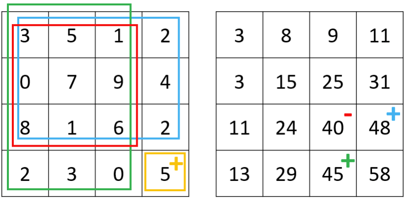
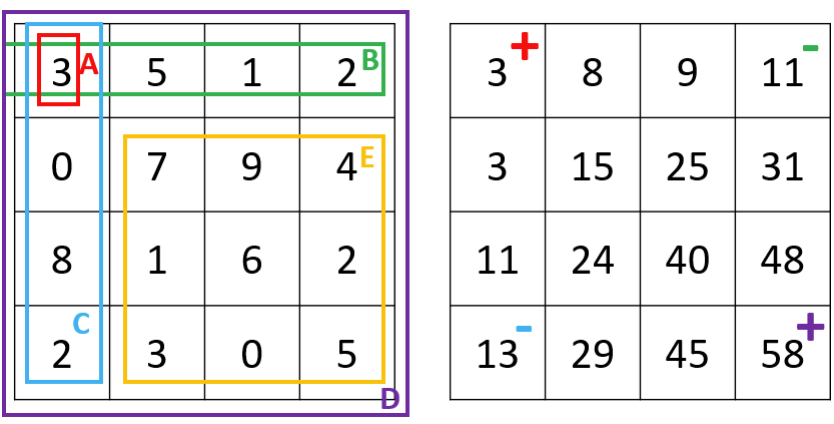

# 10.10 Prefix Sum and Integral Image

A one-dimensional prefix sum (cumulative sum, cumsum) and a two-dimensional integral image (summed-area table, image integral) are techniques used to precompute the sums of one-dimensional segments or two-dimensional rectangles up to each position. This allows for faster calculations and queries. If you need to index values from the prefix sum or integral image, they can be stored in a hash table. If you need to record values for each position, they can be stored in one-dimensional or two-dimensional arrays, often in conjunction with dynamic programming.

## [303. Range Sum Query - Immutable](https://leetcode.com/problems/range-sum-query-immutable/)

### Problem Description

Design a data structure to quickly query the sum of all numbers between any two positions in a given array.

### Input and Output Example

Here is a sample usage of the data structure.

```
vector<int> nums{-2,0,3,-5,2,-1};
NumArray num_array = new NumArray(nums);
num_array.sumRange(0,2); // Result = -2+0+3 = 1.
num_array.sunRange(1,5); // Result = 0+3-5+2-1 = -1.
```

### Solution Explanation

For a one-dimensional array, we can use a prefix sum to solve this problem. First, create a new array `cumsum` of the same length as `nums`, where each position in `cumsum` stores the sum of all numbers in `nums` up to that position. The `cumsum` array can be built using the C++ `partial_sum` function or by iterating through the `nums` array and calculating it using the state transition formula `cumsum[i] = cumsum[i-1] + nums[i]`. To obtain the sum of numbers between positions `i` and `j`, calculate `cumsum[j+1] - cumsum[i]`.

<Tabs>
<TabItem value="cpp" label="C++">

```cpp
class NumArray {
   public:
    NumArray(vector<int> nums) : cumsum_(nums.size() + 1, 0) {
        partial_sum(nums.begin(), nums.end(), cumsum_.begin() + 1);
    }

    int sumRange(int left, int right) {
        return cumsum_[right + 1] - cumsum_[left];
    }

   private:
    vector<int> cumsum_;
};
```

</TabItem>
<TabItem value="py" label="Python">

```py
class NumArray:
    def __init__(self, nums: List[int]):
        self.cumsum = [0] + nums[:]
        for i in range(2, len(self.cumsum)):
            self.cumsum[i] += self.cumsum[i - 1]

    def sumRange(self, left: int, right: int) -> int:
        return self.cumsum[right + 1] - self.cumsum[left]
```

</TabItem>

</Tabs>

## [304. Range Sum Query 2D - Immutable](https://leetcode.com/problems/range-sum-query-2d-immutable/)

### Problem Description

Design a data structure to quickly query the sum of all numbers within a rectangle defined by any two positions in a given matrix.

### Input and Output Example

Here is a sample usage of the data structure. The `sumRegion` function takes four inputs: the row and column of the first point, and the row and column of the second point.

```
vector<int> matrix{{3,0,1,4,2},
 {5,6,3,2,1},
 {1,2,0,1,5},
 {4,1,0,1,7},
 {1,0,3,0,5}
};
NumMatrix num_matrix = new NumMatrix(matrix);
num_matrix.sumRegion(2,1,4,3); // Result = 8.
num_matrix.sumRegion(1,1,2,2); // Result = 11.
```

### Solution Explanation

Similar to prefix sums, we can extend this concept to two dimensions, known as a summed-area table (SAT) or image integral. We can first build an `sat` matrix, where `sat[i][j]` represents the sum of all numbers in the rectangle defined by `(0, 0)` as the top-left corner and `(i-1, j-1)` as the bottom-right corner.

<figure>
  <span style={{ display: 'block', width: '60%', margin: '0 auto' }}>
    
  </span>
  <figcaption style={{ textAlign: 'center' }}>Figure 10.4: Problem 304 - Diagram 1 - The left shows the given matrix, and the right shows the summed-area table. The value at the bottom-right corner of the SAT is 5+48+45−40 = 58.</figcaption>
</figure>


<figure>
  <span style={{ display: 'block', width: '60%', margin: '0 auto' }}>
    
  </span>
  <figcaption style={{ textAlign: 'center' }}>Figure 10.5: Problem 304 - Diagram 2 - The left shows the given matrix, and the right shows the SAT. The sum of rectangle E equals 58 − 11 − 13 + 3 = 37.</figcaption>
</figure>

As shown in Figure 1, we can compute the `sat` matrix using dynamic programming: `sat[i][j] = matrix[i-1][j-1] + sat[i-1][j] + sat[i][j-1] - sat[i-1][j-1]`, which is the value at the current coordinate plus the sum of the rectangle above it plus the sum of the rectangle to its left minus the overlap (i.e., the top-left rectangle).

As shown in Figure 2, suppose we need to query the sum of rectangle E. Since `E = D − B − C + A`, we observe that E can be derived using addition and subtraction of SAT values at four positions. Thus, the preprocessing time complexity is $O(mn)$, while the query time complexity is only $O(1)$.


<Tabs>
<TabItem value="cpp" label="C++">

```cpp
class NumMatrix {
   public:
    NumMatrix(vector<vector<int>> matrix) {
        int m = matrix.size(), n = matrix[0].size();
        sat_ = vector<vector<int>>(m + 1, vector<int>(n + 1, 0));
        for (int i = 1; i <= m; ++i) {
            for (int j = 1; j <= n; ++j) {
                sat_[i][j] = matrix[i - 1][j - 1] + sat_[i - 1][j] +
                             sat_[i][j - 1] - sat_[i - 1][j - 1];
            }
        }
    }

    int sumRegion(int row1, int col1, int row2, int col2) {
        return sat_[row2 + 1][col2 + 1] - sat_[row2 + 1][col1] -
               sat_[row1][col2 + 1] + sat_[row1][col1];
    }

   private:
    vector<vector<int>> sat_;
};
```

</TabItem>
<TabItem value="py" label="Python">

```py
class NumMatrix:
    def __init__(self, matrix: List[List[int]]):
        m, n = len(matrix), len(matrix[0])
        self.sat = [[0 for _ in range(n + 1)] for _ in range(m + 1)]
        
        for i in range(1, m + 1):
            for j in range(1, n + 1):
                self.sat[i][j] = (
                    matrix[i - 1][j - 1]
                    + self.sat[i - 1][j]
                    + self.sat[i][j - 1]
                    - self.sat[i - 1][j - 1]
                )

    def sumRegion(self, row1: int, col1: int, row2: int, col2: int) -> int:
        return (
            self.sat[row2 + 1][col2 + 1]
            - self.sat[row2 + 1][col1]
            - self.sat[row1][col2 + 1]
            + self.sat[row1][col1]
        )

```

</TabItem>

</Tabs>

## [560. Subarray Sum Equals K](https://leetcode.com/problems/subarray-sum-equals-k/)

### Problem Description

Given an array, find the number of continuous subarrays whose sum equals $k$.

### Input and Output Example

Input is a one-dimensional integer array and an integer value $k$; output is an integer representing the number of subarrays that meet the condition.

```
Input: nums = [1,1,1], k = 2
Output: 2
```

In this example, we can find two subarrays [1,1] that satisfy the condition.

### Solution Explanation

This problem also uses prefix sums. The difference here is that we employ a hash table `cache` where the keys are prefix sums and the values are the number of times that prefix sum appears. When iterating to position $i$, if the current prefix sum is `cumsum`, then `cache[cumsum-k]` represents the number of subarrays ending at the current position that satisfy the condition.

<Tabs>
<TabItem value="cpp" label="C++">

```cpp
int subarraySum(vector<int>& nums, int k) {
    int count = 0, cumsum = 0;
    unordered_map<int, int> cache;  // <cumsum, frequency>
    cache[0] = 1;
    for (int num : nums) {
        cumsum += num;
        count += cache[cumsum - k];
        ++cache[cumsum];
    }
    return count;
}
```

</TabItem>
<TabItem value="py" label="Python">

```py
def subarraySum(nums: List[int], k: int) -> int:
    count, cur_sum = 0, 0
    cache = {0: 1} # <cumsum, frequency>
    for num in nums:
        cur_sum += num
        count += cache.get(cur_sum - k, 0)
        cache[cur_sum] = cache.get(cur_sum, 0) + 1
    return count
```

</TabItem>

</Tabs>

