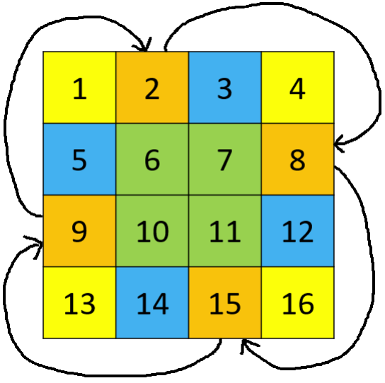

# 10.3 Arrays

## [448. Find All Numbers Disappeared in an Array](https://leetcode.com/problems/find-all-numbers-disappeared-in-an-array/)

### Problem Description

Given an array of length n containing integers in the range from 1 to n, some integers appear multiple times, while others do not appear at all. Find all integers from 1 to n that are missing in the array.

### Input and Output Example

Input is a one-dimensional integer array, and the output is also a one-dimensional integer array representing the numbers that do not appear in the input array.

```
Input: [4,3,2,7,8,2,3,1]
Output: [5,6]
```

By using the array as a data structure to create n buckets, mark all positions where numbers appear multiple times, and then traverse the array to find the missing numbers. Furthermore, we can directly modify the original array: mark the positions corresponding to the numbers that appear as negative (this maps numbers from 1 to n to indices 0 to n-1), and the indices that remain positive correspond to the missing numbers.

### Solution Explanation

<Tabs>
<TabItem value="cpp" label="C++">

```cpp
vector<int> findDisappearedNumbers(vector<int>& nums) {
    vector<int> disappeared;
    for (int num : nums) {
        int pos = abs(num) - 1;
        if (nums[pos] > 0) {
            nums[pos] = -nums[pos];
        }
    }
    for (int i = 0; i < nums.size(); ++i) {
        if (nums[i] > 0) {
            disappeared.push_back(i + 1);
        }
    }
    return disappeared;
}
```

</TabItem>
<TabItem value="py" label="Python">

```py
def findDisappearedNumbers(nums: List[int]) -> List[int]:
    for num in nums:
        pos = abs(num) - 1
        if nums[pos] > 0:
            nums[pos] = -nums[pos]
    return [i + 1 for i in range(len(nums)) if nums[i] > 0]
```

</TabItem>

</Tabs>

## [48. Rotate Image](https://leetcode.com/problems/rotate-image/)

### Problem Description

Given an n × n matrix, rotate it 90 degrees clockwise in place. How can this be done with minimal additional storage space?

### Input and Output Example

Both the input and output are two-dimensional integer matrices.

```
Input:
[[1,2,3],
 [4,5,6],
 [7,8,9]]
Output:
[[7,4,1],
 [8,5,2],
 [9,6,3]]
```

### Solution Explanation

Consider four positions spaced 90 degrees apart each time, and perform an $O(1)$ space rotation.

<figure>
  <span style={{ display: 'block', width: '30%', margin: '0 auto' }}>
    
  </span>
  <figcaption style={{ textAlign: 'center' }}>Figure 10.1: Problem 48 - Example of $O(1)$ space rotation, same colors indicate four positions to be swapped</figcaption>
</figure>

<Tabs>
<TabItem value="cpp" label="C++">

```cpp
void rotate(vector<vector<int>>& matrix) {
    int pivot = 0, n = matrix.size() - 1;
    for (int i = 0; i <= n / 2; ++i) {
        for (int j = i; j < n - i; ++j) {
            pivot = matrix[j][n - i];
            matrix[j][n - i] = matrix[i][j];
            matrix[i][j] = matrix[n - j][i];
            matrix[n - j][i] = matrix[n - i][n - j];
            matrix[n - i][n - j] = pivot;
        }
    }
}
```

</TabItem>
<TabItem value="py" label="Python">

```py
def rotate(matrix: List[List[int]]) -> None:
    n = len(matrix) - 1
    for i in range(n // 2 + 1):
        for j in range(i, n - i):
            pivot = matrix[j][n - i]
            matrix[j][n - i] = matrix[i][j]
            matrix[i][j] = matrix[n - j][i]
            matrix[n - j][i] = matrix[n - i][n - j]
            matrix[n - i][n - j] = pivot
```

</TabItem>

</Tabs>

## [240. Search a 2D Matrix II](https://leetcode.com/problems/search-a-2d-matrix-ii/)

### Problem Description

Given a 2D matrix where each row and each column is sorted in ascending order, design a fast algorithm to search for a number in the matrix.

### Input and Output Example

The input is a two-dimensional integer matrix and a target integer to search. The output is a boolean value indicating whether the integer exists in the matrix.

```
Input: matrix =
[ [1, 4, 7, 11, 15],
  [2, 5, 8, 12, 19],
  [3, 6, 9, 16, 22],
  [10, 13, 14, 17, 24],
  [18, 21, 23, 26, 30]], target = 5
Output: true
```

### Solution Explanation

There is a simple trick for this problem: Start searching from the top-right corner. If the current value is greater than the target, move left; if it is smaller than the target, move down. If you reach the bottom-left corner without finding the target, the value does not exist in the matrix.

<Tabs>
<TabItem value="cpp" label="C++">

```cpp
bool searchMatrix(vector<vector<int>>& matrix, int target) {
    int m = matrix.size(), n = matrix[0].size();
    int i = 0, j = n - 1;
    while (i < m && j >= 0) {
        if (matrix[i][j] == target) {
            return true;
        } else if (matrix[i][j] < target) {
            ++i;
        } else {
            --j;
        }
    }
    return false;
}
```

</TabItem>
<TabItem value="py" label="Python">

```py
def searchMatrix(matrix: List[List[int]], target: int) -> bool:
    m, n = len(matrix), len(matrix[0])
    i, j = 0, n - 1
    while i < m and j >= 0:
        if matrix[i][j] == target:
            return True
        if matrix[i][j] < target:
            i += 1
        else:
            j -= 1
    return False
```

</TabItem>

</Tabs>

## [769. Max Chunks To Make Sorted](https://leetcode.com/problems/max-chunks-to-make-sorted/)

### Problem Description

Given an array of integers containing 0 to n, where each integer appears only once, find the maximum number of chunks you can split the array into such that sorting each chunk results in the entire array being sorted in ascending order.

### Input and Output Example

The input is a one-dimensional integer array, and the output is an integer representing the maximum number of chunks.

```
Input: [1,0,2,3,4]
Output: 4
```

In this example, the maximum chunks are [1, 0], [2], [3], [4].

### Solution Explanation

Iterate from left to right, keeping track of the current maximum value. Whenever the current maximum value equals the current array index, we can perform a split.

Why does this algorithm work? If the current maximum value is greater than the current array index, it means there are smaller values on the right that need to be included in the chunk. Since the array contains only unique integers from 0 to n, the current maximum value will never be less than the current index. Therefore, whenever the current maximum value equals the current index, say p, we can successfully make a split. The values between the previous split point q and p will always contain all integers from q+1 to p.

<Tabs>
<TabItem value="cpp" label="C++">

```cpp
int maxChunksToSorted(vector<int>& arr) {
    int chunks = 0, cur_max = 0;
    for (int i = 0; i < arr.size(); ++i) {
        cur_max = max(cur_max, arr[i]);
        chunks += cur_max == i;
    }
    return chunks;
}
```

</TabItem>
<TabItem value="py" label="Python">

```py
def maxChunksToSorted(arr: List[int]) -> int:
    chunks, cur_max = 0, 0
    for i, num in enumerate(arr):
        cur_max = max(cur_max, num)
        chunks += cur_max == i
    return chunks
```

</TabItem>

</Tabs>