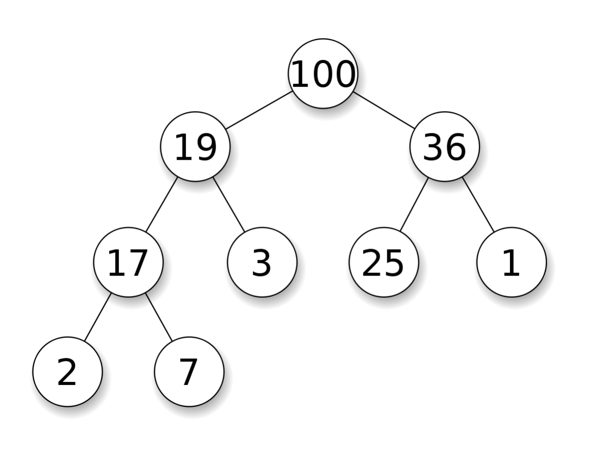
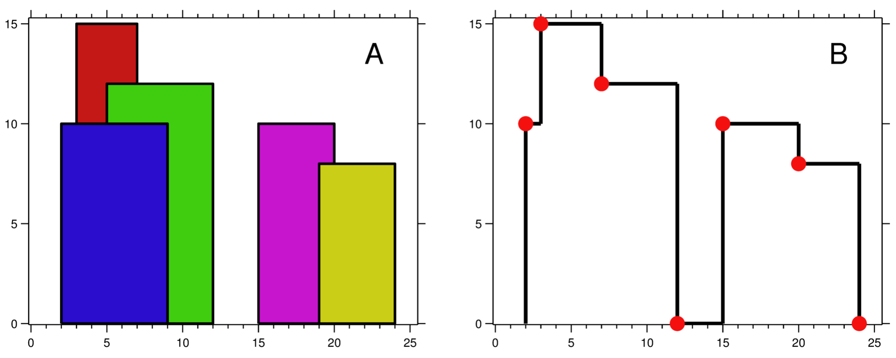

# 10.6 Priority Queue

`Priority queue` allows retrieving the maximum value in $O(1)$ time and inserting or removing the maximum value in $O(\log n)$ time.

<figure>
  <span style={{ display: 'block', width: '50%', margin: '0 auto' }}>
    
  </span>
  <figcaption style={{ textAlign: 'center' }}>Figure 10.2: (Max) Heap, maintaining the "greater than" relationship in the data structure</figcaption>
</figure>

Priority queues are often implemented using heaps. A heap is a complete binary tree in which each node's value is always greater than or equal to its child nodes. When implementing heaps, arrays are often used instead of pointers to build a tree. This is because heaps are complete binary trees, so in an array representation, the parent node of position $i$ is located at $(i-1)/2$, and its two child nodes are located at $2i+1$ and $2i+2$, respectively.

Here is the implementation of heaps. The two core operations are "swim" and "sink": if a node is greater than its parent node, we swap them; after swapping, it may still be greater than its new parent node, so we continue comparing and swapping, known as "swim." Similarly, if a node is smaller than its parent, it needs to compare and swap downward continuously, known as "sink." If a node has two child nodes, we always swap with the largest child node.


<Tabs>
<TabItem value="cpp" label="C++">

```cpp
class Heap {
   public:
    Heap() {}
    // Swim
    void swim(int pos) {
        int next_pos = (pos - 1) / 2;
        while (pos > 0 && heap_[next_pos] < heap_[pos]) {
            swap(heap_[next_pos], heap_[pos]);
            pos = next_pos;
            next_pos = (pos - 1) / 2;
        }
    }
    // Sink
    void sink(int pos) {
        int n = heap_.size();
        int next_pos = 2 * pos + 1;
        while (next_pos < n) {
            if (next_pos < n - 1 && heap_[next_pos] < heap_[next_pos + 1]) {
                ++next_pos;
            }
            if (heap_[pos] >= heap_[next_pos]) {
                break;
            }
            swap(heap_[next_pos], heap_[pos]);
            pos = next_pos;
            next_pos = 2 * pos + 1;
        }
    }
    // Insert any value: place the new number at the last position, then swim.
    void push(int k) {
        heap_.push_back(k);
        swim(heap_.size() - 1);
    }
    // Delete the maximum value: move the last number to the front, then sink.
    void pop() {
        heap_[0] = heap_.back();
        heap_.pop_back();
        sink(0);
    }
    // Retrieve the maximum value.
    int top() { return heap_[0]; }

   private:
    vector<int> heap_;
};
```

</TabItem>
<TabItem value="py" label="Python">

```py
class Heap:
    def __init__(self):
        self.heap = []

    # Swim
    def swim(self, pos: int):
        next_pos = (pos - 1) // 2
        while pos > 0 and self.heap[next_pos] < self.heap[pos]:
            self.heap[next_pos], self.heap[pos] = self.heap[pos], self.heap[next_pos]
            pos = next_pos
            next_pos = (pos - 1) // 2

    # Sink
    def sink(self, pos: int):
        n = len(self.heap)
        next_pos = 2 * pos + 1
        while next_pos < n:
            if next_pos < n - 1 and self.heap[next_pos] < self.heap[next_pos + 1]:
                next_pos += 1
            if self.heap[pos] >= self.heap[next_pos]:
                break
            self.heap[next_pos], self.heap[pos] = self.heap[pos], self.heap[next_pos]
            pos = next_pos
            next_pos = 2 * pos + 1

    # Insert any value: place the new number at the last position, then swim.
    def push(self, k: int):
        self.heap.append(k)
        self.swim(len(self.heap) - 1)

    # Delete the maximum value: move the last number to the front, then sink.
    def pop(self):
        self.heap[0] = self.heap.pop()
        self.sink(0)

    # Retrieve the maximum value.
    def top(self) -> int:
        return self.heap[0]

```

</TabItem>

</Tabs>

By swapping the greater-than and less-than operators in the algorithm, we can also create a priority queue that retrieves the minimum value quickly.

## [23. Merge k Sorted Lists](https://leetcode.com/problems/merge-k-sorted-lists/)

### Problem Description

Given `k` sorted linked lists, try to merge them into one sorted linked list.

### Input and Output Example

The input is a one-dimensional array, where each position stores the head node of a linked list; the output is a single linked list.

```
Input:
[1->4->5,
 1->3->4,
 2->6]
Output: 1->1->2->3->4->4->5->6
```

### Solution Explanation

There are multiple ways to solve this problem, such as using a merge sort-like approach to merge the lists pair by pair. Here, we demonstrate a faster method: store all the linked lists in a priority queue and extract the node with the smallest value from the head of all lists at each step until all lists have been completely merged.

Since the default comparison function of a C++ `priority_queue` is for a max-heap and maintains an increasing order, to get the smallest node values, we need to implement a min-heap. Thus, the comparison function for the heap should maintain a decreasing order, i.e., the lambda function should use the greater-than operator instead of the less-than operator used for increasing order.

<Tabs>
<TabItem value="cpp" label="C++">

```cpp
ListNode* mergeKLists(vector<ListNode*>& lists) {
    auto comp = [](ListNode* l1, ListNode* l2) { return l1->val > l2->val; };
    priority_queue<ListNode*, vector<ListNode*>, decltype(comp)> pq;
    for (ListNode* l : lists) {
        if (l) {
            pq.push(l);
        }
    }
    ListNode *dummy = new ListNode(0), *cur = dummy;
    while (!pq.empty()) {
        cur->next = pq.top();
        pq.pop();
        cur = cur->next;
        if (cur->next) {
            pq.push(cur->next);
        }
    }
    return dummy->next;
}
```

</TabItem>
<TabItem value="py" label="Python">

```py
def mergeKLists(lists: List[Optional[ListNode]]) -> Optional[ListNode]:
    pq = []
    for idx, l in enumerate(lists):
        if l is not None:
            # ListNode cannot be hashed, so we directly record its position in lists.
            pq.append((l.val, idx))
    heapq.heapify(pq)
    
    dummy = ListNode()
    cur = dummy
    
    while len(pq) > 0:
        _, l_idx = heapq.heappop(pq)
        cur.next = lists[l_idx]
        cur = cur.next
        if cur.next is not None:
            lists[l_idx] = lists[l_idx].next
            heapq.heappush(pq, (cur.next.val, l_idx))
    
    return dummy.next

```

</TabItem>

</Tabs>

## [218. The Skyline Problem](https://leetcode.com/problems/the-skyline-problem/)

### Problem Description

Given the start and end positions along with the height of buildings, return the critical points of the building's silhouette (skyline).

### Input and Output Example

The input is a 2D integer array representing each building as `[left, right, height]`; the output is a 2D integer array representing the x and y coordinates of the critical points of the skyline.

<figure>
  <span style={{ display: 'block', width: '90%', margin: '0 auto' }}>
    
  </span>
  <figcaption style={{ textAlign: 'center' }}>Figure 10.3: Problem 218 - Example of buildings and their skyline</figcaption>
</figure>

```
Input: [[2 9 10], [3 7 15], [5 12 12], [15 20 10], [19 24 8]]
Output: [[2 10], [3 15], [7 12], [12 0], [15 10], [20 8], [24, 0]]
```

### Solution Explanation

We can use a priority queue to store the height and the right endpoint of each building (using a pair). This helps us identify the next building that raises the skyline and interferes with the previous building's endpoint.

Since Python's `heapq` implements a min-heap, we store negative values for heights to simulate a max-heap.

This problem is relatively complex. If you find it challenging to grasp, consider skipping it for now or illustrating examples on paper for better understanding.

<Tabs>
<TabItem value="cpp" label="C++">

```cpp
vector<vector<int>> getSkyline(vector<vector<int>>& buildings) {
    vector<vector<int>> skyline;
    priority_queue<pair<int, int>> pq;  // <height, right>
    int i = 0, n = buildings.size();
    int cur_x, cur_h;
    while (i < n || !pq.empty()) {
        if (pq.empty() || (i < n && buildings[i][0] <= pq.top().second)) {
            cur_x = buildings[i][0];
            while (i < n && cur_x == buildings[i][0]) {
                pq.emplace(buildings[i][2], buildings[i][1]);
                ++i;
            }
        } else {
            cur_x = pq.top().second;
            while (!pq.empty() && cur_x >= pq.top().second) {
                pq.pop();
            }
        }
        cur_h = pq.empty() ? 0 : pq.top().first;
        if (skyline.empty() || cur_h != skyline.back()[1]) {
            skyline.push_back({cur_x, cur_h});
        }
    }
    return skyline;
}
```

</TabItem>
<TabItem value="py" label="Python">

```py
def getSkyline(buildings: List[List[int]]) -> List[List[int]]:
    skyline = []
    pq = []  # <negative height, right>
    heapq.heapify(pq)
    i, n = 0, len(buildings)
    
    while i < n or len(pq) > 0:
        if len(pq) == 0 or (i < n and buildings[i][0] <= pq[0][1]):
            cur_x = buildings[i][0]
            while i < n and cur_x == buildings[i][0]:
                heapq.heappush(pq, (-buildings[i][2], buildings[i][1]))
                i += 1
        else:
            cur_x = pq[0][1]
            while len(pq) > 0 and cur_x >= pq[0][1]:
                heapq.heappop(pq)
        
        cur_h = -pq[0][0] if len(pq) > 0 else 0
        if len(skyline) == 0 or cur_h != skyline[-1][1]:
            skyline.append([cur_x, cur_h])
    
    return skyline

```

</TabItem>

</Tabs>