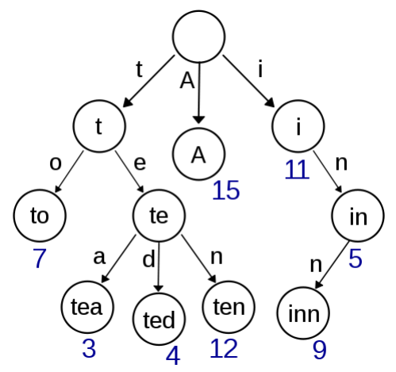

# 13.6 Trie

A Trie is a tree-like data structure used to determine whether a string exists or whether it has a specific prefix.

<figure>
  <span style={{ display: 'block', width: '50%', margin: '0 auto' }}>
    
  </span>
  <figcaption style={{ textAlign: 'center' }}>Fig. 13.1: Trie storing words A, to, tea, ted, ten, i, in, and inn, along with their frequencies</figcaption>
</figure>

Why use a Trie for such problems? Suppose we have a dictionary storing nearly 10,000 words. Even with a hash table, searching for a word can be computationally expensive, and supporting prefix-based searches becomes difficult. However, since the length of an English word, `n`, is usually less than 10, using a Trie allows searches to be completed in $O(n)$—approximately $O(1)$ time—with minimal additional overhead.

## [208. Implement Trie (Prefix Tree)](https://leetcode.com/problems/implement-trie-prefix-tree/)

### Problem Description

Create a Trie that supports fast insertion of words, word lookup, and prefix lookup.

### Input and Output Example

Below is an example of how to use the data structure.

```
Trie trie = new Trie();
trie.insert("apple");
trie.search("apple"); // true
trie.search("app"); // false
trie.startsWith("app"); // true
trie.insert("app");
trie.search("app"); // true
```

### Solution Explanation

Here is the typical implementation of a Trie.

<Tabs>
<TabItem value="cpp" label="C++">

```cpp
struct TrieNode {
    bool word_ends;
    vector<TrieNode*> children;
    TrieNode() : word_ends(false), children(26, nullptr) {}
};

class Trie {
   public:
    Trie() : root_(new TrieNode()) {}

    void insert(string word) {
        TrieNode* node = root_;
        for (char c : word) {
            int pos = c - ’a’;
            if (node->children[pos] == nullptr) {
                node->children[pos] = new TrieNode();
            }
            node = node->children[pos];
        }
        node->word_ends = true;
    }

    bool search(string word) {
        TrieNode* node = root_;
        for (char c : word) {
            if (node == nullptr) {
                break;
            }
            node = node->children[c - ’a’];
        }
        return node != nullptr && node->word_ends;
    }

    bool startsWith(string prefix) {
        TrieNode* node = root_;
        for (char c : prefix) {
            if (node == nullptr) {
                break;
            }
            node = node->children[c - ’a’];
        }
        return node != nullptr;
    }

   private:
    TrieNode* root_;
};
```

</TabItem>
<TabItem value="py" label="Python">

```py
class TrieNode:
    def __init__(self):
        self.word_ends = False
        self.children = [None] * 26

class Trie:
    def __init__(self):
        self.root = TrieNode()

    def insert(self, word: str) -> None:
        node = self.root
        for c in word:
            pos = ord(c) - ord("a")
            if node.children[pos] is None:
                node.children[pos] = TrieNode()
            node = node.children[pos]
        node.word_ends = True

    def search(self, word: str) -> bool:
        node = self.root
        for c in word:
            if node is None:
                break
            node = node.children[ord(c) - ord("a")]
        return node is not None and node.word_ends

    def startsWith(self, prefix: str) -> bool:
        node = self.root
        for c in prefix:
            if node is None:
                break
            node = node.children[ord(c) - ord("a")]
        return node is not None

```

</TabItem>

</Tabs>