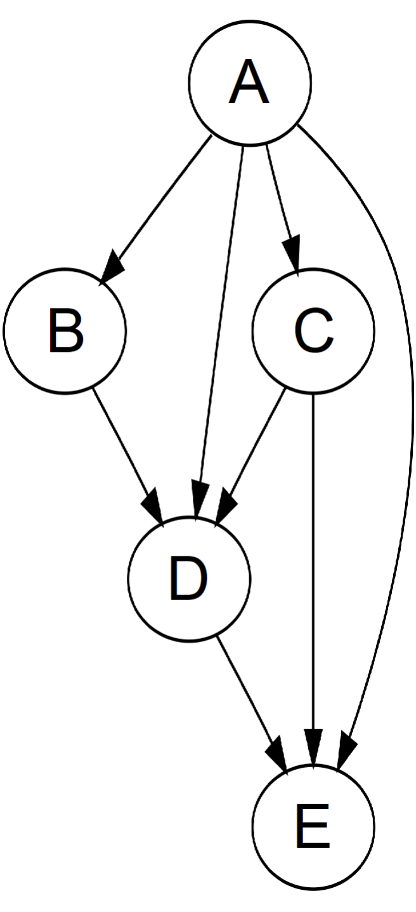

# 14.1 Data Structure Introduction

As the third member of the pointer triumvirate, graphs are an advanced version of trees. A `graph` can be classified as directed or undirected, cyclic or acyclic, and connected or disconnected. A tree is essentially a connected, undirected, acyclic graph. Another common type of graph is the `Directed Acyclic Graph (DAG)`.

<figure>
  
    
  
  <figcaption style={{ textAlign: 'center' }}>Figure 14.1: Example of a Directed Acyclic Graph</figcaption>
</figure>

There are two common ways to represent a graph. Suppose there are `n` nodes and `m` edges in the graph. The first method is the `adjacency matrix`: we can create an `n × n` matrix `G`, where `G[i][j] = 1` if node `i` is connected to node `j`, and `0` otherwise. For an undirected graph, the matrix is symmetric, i.e., `G[i][j] = G[j][i]`. The second method is the `adjacency list`: we can create an array of size `n`, where each index `i` stores an array or linked list representing the nodes connected to node `i`. The adjacency matrix requires more memory but allows for faster edge lookup, whereas the adjacency list is more space-efficient but does not support quick edge existence checks. Additionally, we can use an `m × 2` matrix to store all the edges directly.
