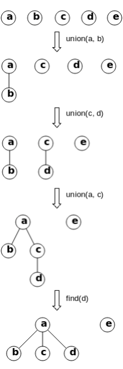

# 15.2 Union-Find

`Union-Find` (disjoint set) is a data structure used for dynamic connectivity problems. It efficiently connects two points and determines whether two points are connected. Given `n` nodes, we initialize the parent of each node to itself. To connect nodes `i` and `j`, we attach the smaller rank's parent to the larger rank's parent (union by rank). To check if two nodes are connected, we find their ancestors and determine if they are the same, applying path compression to speed up subsequent queries.

<figure>
  <span style={{ display: 'block', width: '30%', margin: '0 auto' }}>
    
  </span>
  <figcaption style={{ textAlign: 'center' }}>Figure 15.1: Union-Find Example. `union` merges two sets by rank, and `find` retrieves a node's ancestor while compressing paths.</figcaption>
</figure>

## [684. Redundant Connection](https://leetcode.com/problems/redundant-connection/)

### Problem Description

In an undirected graph, find an edge that, when removed, leaves the graph as a tree (i.e., acyclic and connected). If there are multiple solutions, return the edge appearing last in the input.

### Input and Output Example

The input is a 2D array representing all edges (pairs of nodes), and the output is a 1D array representing the edge to remove.

```
Input: [[1,2], [1,3], [2,3]]
  1
 / \
2 - 3
Output: [2,3]
```

### Solution Explanation

Since we need to determine whether two nodes are repeatedly connected, we can solve this problem using the Union-Find data structure. The detailed implementation is as follows:

<Tabs>
<TabItem value="cpp" label="C++">

```cpp
class Solution {
   public:
    vector<int> findRedundantConnection(vector<vector<int>>& edges) {
        n_ = edges.size();
        id_ = vector<int>(n_);
        depth_ = vector<int>(n_, 1);
        for (int i = 0; i < n_; ++i) {
            id_[i] = i;
        }
        for (auto& edge : edges) {
            int i = edge[0], j = edge[1];
            if (linked(i - 1, j - 1)) {
                return vector<int>{i, j};
            }
            connect(i - 1, j - 1);
        }
        return vector<int>();
    }

   private:
    int find(int i) {
        // Path Compression
        while (i != id_[i]) {
            id_[i] = id_[id_[i]];
            i = id_[i];
        }
        return i;
    }

    void connect(int i, int j) {
        i = find(i), j = find(j);
        if (i == j) {
            return;
        }
        // Union by Rank
        if (depth_[i] <= depth_[j]) {
            id_[i] = j;
            depth_[j] = max(depth_[j], depth_[i] + 1);
        } else {
            id_[j] = i;
            depth_[i] = max(depth_[i], depth_[j] + 1);
        }
    }

    bool linked(int i, int j) { return find(i) == find(j); }

    int n_;
    vector<int> id_;
    vector<int> depth_;
};
```

</TabItem>
<TabItem value="py" label="Python">

```py
class Solution:
    def __init__(self):
        self.n = 0
        self.id = None
        self.depth = None

    def find(self, i: int) -> int:
        # Path Compression
        while i != self.id[i]:
            self.id[i] = self.id[self.id[i]]
            i = self.id[i]
        return i

    def connect(self, i: int, j: int):
        i = self.find(i)
        j = self.find(j)
        if i == j:
            return
        # Union by Rank
        if self.depth[i] <= self.depth[j]:
            self.id[i] = j
            self.depth[j] = max(self.depth[j], self.depth[i] + 1)
        else:
            self.id[j] = i
            self.depth[i] = max(self.depth[i], self.depth[j] + 1)

    def linked(self, i: int, j: int) -> bool:
        return self.find(i) == self.find(j)

    def findRedundantConnection(self, edges: List[List[int]]) -> List[int]:
        self.n = len(edges)
        self.id = list(range(self.n))
        self.depth = [1] * self.n
        for i, j in edges:
            if self.linked(i - 1, j - 1):
                return [i, j]
            self.connect(i - 1, j - 1)
        return []
```

</TabItem>

</Tabs>