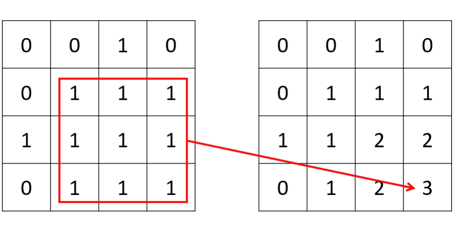

# 6.3 基本动态规划：二维

## [64. Minimum Path Sum](https://leetcode.com/problems/minimum-path-sum/)

### Problem Description

给定一个 $m × n$ 大小的非负整数矩阵，求从左上角开始到右下角结束的、经过的数字的和最
小的路径。每次只能向右或者向下移动。

### Input and Output Example

输入是一个二维数组，输出是最优路径的数字和。

```
Input:
[[1,3,1],
 [1,5,1],
 [4,2,1]]
Output: 7
```

在这个样例中，最短路径为 1->3->1->1->1。

### Solution Explanation

我们可以定义一个同样是二维的 dp 数组，其中 dp[i][j] 表示从左上角开始到 (i, j) 位置的最优路径的数字和。因为每次只能向下或者向右移动，我们可以很直观地得到状态转移方程 dp[i][j] = grid[i][j] + min(dp[i-1][j], dp[i][j-1])，其中 grid 表示原数组。

:::warning

Python 语言中，多维数组多初始化比较特殊，直接初始化为 [[val] * n] * m 会导致只是创造了 m 个 [[val] * n] 的引用。正确的初始化方法为 [[val for _ in range(n)] for _ in range(m)]。

:::

<Tabs>
<TabItem value="cpp" label="C++">

```cpp
int minPathSum(vector<vector<int>>& grid) {
    int m = grid.size(), n = grid[0].size();
    vector<vector<int>> dp(m, vector<int>(n, 0));
    for (int i = 0; i < m; ++i) {
        for (int j = 0; j < n; ++j) {
            if (i == 0 && j == 0) {
                dp[i][j] = grid[i][j];
            } else if (i == 0) {
                dp[i][j] = grid[i][j] + dp[i][j - 1];
            } else if (j == 0) {
                dp[i][j] = grid[i][j] + dp[i - 1][j];
            } else {
                dp[i][j] = grid[i][j] + min(dp[i - 1][j], dp[i][j - 1]);
            }
        }
    }
    return dp[m - 1][n - 1];
}
```

</TabItem>
<TabItem value="py" label="Python">

```py
def minPathSum(grid: List[List[int]]) -> int:
    m, n = len(grid), len(grid[0])
    dp = [[0 for _ in range(n)] for _ in range(m)]
    for i in range(m):
        for j in range(n):
            if i == j == 0:
                dp[i][j] = grid[i][j]
            elif i == 0:
                dp[i][j] = grid[i][j] + dp[i][j - 1]
            elif j == 0:
                dp[i][j] = grid[i][j] + dp[i - 1][j]
            else:
                dp[i][j] = grid[i][j] + min(dp[i][j - 1], dp[i - 1][j])
    return dp[m - 1][n - 1]
```

</TabItem>

</Tabs>

因为 dp 矩阵的每一个值只和左边和上面的值相关，我们可以使用空间压缩将 dp 数组压缩为一维。对于第 i 行，在遍历到第 j 列的时候，因为第 j-1 列已经更新过了，所以 dp[j-1] 代表 dp[i][j-1]的值；而 dp[j] 待更新，当前存储的值是在第 i-1 行的时候计算的，所以代表 dp[i-1][j] 的值。

:::warning

如果不是很熟悉空间压缩技巧，笔者推荐您优先尝试写出非空间压缩的解法，如果时间充裕且力所能及再进行空间压缩。

:::


<Tabs>
<TabItem value="cpp" label="C++">

```cpp
int minPathSum(vector<vector<int>>& grid) {
    int m = grid.size(), n = grid[0].size();
    vector<int> dp(n, 0);
    for (int i = 0; i < m; ++i) {
        for (int j = 0; j < n; ++j) {
            if (i == 0 && j == 0) {
                dp[j] = grid[i][j];
            } else if (i == 0) {
                dp[j] = grid[i][j] + dp[j - 1];
            } else if (j == 0) {
                dp[j] = grid[i][j] + dp[j];
            } else {
                dp[j] = grid[i][j] + min(dp[j], dp[j - 1]);
            }
        }
    }
    return dp[n - 1];
}
```

</TabItem>
<TabItem value="py" label="Python">

```py
def minPathSum(grid: List[List[int]]) -> int:
    m, n = len(grid), len(grid[0])
    dp = [0 for _ in range(n)]
    for i in range(m):
        for j in range(n):
        if i == j == 0:
            dp[j] = grid[i][j]
        elif i == 0:
            dp[j] = grid[i][j] + dp[j - 1]
        elif j == 0:
            dp[j] = grid[i][j] + dp[j]
        else:
            dp[j] = grid[i][j] + min(dp[j - 1], dp[j])
    return dp[n - 1]
```

</TabItem>

</Tabs>


## [542. 01 Matrix](https://leetcode.com/problems/01-matrix/)

### Problem Description

给定一个由 0 和 1 组成的二维矩阵，求每个位置到最近的 0 的距离。

### Input and Output Example

输入是一个二维 0-1 数组，输出是一个同样大小的非负整数数组，表示每个位置到最近的 0 的距离。

```
Input:
[[0,0,0],
 [0,1,0],
 [1,1,1]]

Output:
[[0,0,0],
 [0,1,0],
 [1,2,1]]
```

### Solution Explanation

一般来说，因为这道题涉及到四个方向上的最近搜索，所以很多人的第一反应可能会是广度优先搜索。但是对于一个大小 $O(mn)$ 的二维数组，对每个位置进行四向搜索，最坏情况的时间复杂度（即全是 1）会达到恐怖的 $O(m^2n^2)$。一种办法是使用一个二维布尔值数组做 memoization，使得广度优先搜索不会重复遍历相同位置；另一种更简单的方法是，我们从左上到右下进行一次动态搜索，再从右下到左上进行一次动态搜索。两次动态搜索即可完成四个方向上的查找。


<Tabs>
<TabItem value="cpp" label="C++">

```cpp
vector<vector<int>> updateMatrix(vector<vector<int>>& matrix) {
    int m = matrix.size(), n = matrix[0].size();
    vector<vector<int>> dp(m, vector<int>(n, numeric_limits<int>::max() - 1));
    for (int i = 0; i < m; ++i) {
        for (int j = 0; j < n; ++j) {
            if (matrix[i][j] != 0) {
                if (i > 0) {
                    dp[i][j] = min(dp[i][j], dp[i - 1][j] + 1);
                }
                if (j > 0) {
                    dp[i][j] = min(dp[i][j], dp[i][j - 1] + 1);
                }
            } else {
                dp[i][j] = 0;
            }
        }
    }
    for (int i = m - 1; i >= 0; --i) {
        for (int j = n - 1; j >= 0; --j) {
            if (matrix[i][j] != 0) {
                if (i < m - 1) {
                    dp[i][j] = min(dp[i][j], dp[i + 1][j] + 1);
                }
                if (j < n - 1) {
                    dp[i][j] = min(dp[i][j], dp[i][j + 1] + 1);
                }
            }
        }
    }
    return dp;
}
```

</TabItem>
<TabItem value="py" label="Python">

```py
def updateMatrix(matrix: List[List[int]]) -> List[List[int]]:
    m, n = len(matrix), len(matrix[0])
    dp = [[sys.maxsize - 1 for _ in range(n)] for _ in range(m)]
    for i in range(m):
        for j in range(n):
            if matrix[i][j] != 0:
                if i > 0:
                    dp[i][j] = min(dp[i][j], dp[i - 1][j] + 1)
                if j > 0:
                    dp[i][j] = min(dp[i][j], dp[i][j - 1] + 1)
            else:
                dp[i][j] = 0
    for i in range(m - 1, -1, -1): # m-1 to 0, reversed
        for j in range(n - 1, -1, -1): # n-1 to 0, reversed
            if matrix[i][j] != 0:
                if i < m - 1:
                    dp[i][j] = min(dp[i][j], dp[i + 1][j] + 1)
                if j < n - 1:
                    dp[i][j] = min(dp[i][j], dp[i][j + 1] + 1)
        return dp
```

</TabItem>

</Tabs>

## [221. Maximal Square](https://leetcode.com/problems/maximal-square/)

### Problem Description

给定一个二维的 0-1 矩阵，求全由 1 构成的最大正方形面积。

### Input and Output Example

输入是一个二维 0-1 数组，输出是最大正方形面积。

```
Input:
[["1","0","1","0","0"],
 ["1","0","1","1","1"],
 ["1","1","1","1","1"],
 ["1","0","0","1","0"]]
Output: 4
```

### Solution Explanation

对于在矩阵内搜索正方形或长方形的题型，一种常见的做法是定义一个二维 dp 数组，其中 dp[i][j] 表示满足题目条件的、以 (i, j) 为右下角的正方形或者长方形的属性。对于本题，则表示以 (i, j) 为右下角的全由 1 构成的最大正方形边长。如果当前位置是 0，那么 dp[i][j] 即为 0；如果当前位置是 1，我们假设 dp[i][j] = k，其充分条件为 dp[i-1][j-1]、dp[i][j-1] 和 dp[i-1][j] 的值必须都不小于 k − 1，否则 (i, j) 位置不可以构成一个面积为 $k^2$ 的正方形。同理，如果这三个值中的的最小值为 k − 1，则 (i, j) 位置一定且最大可以构成一个面积为 $k^2$ 的正方形。


<figure>
  <span style={{ display: 'block', width: '75%', margin: '0 auto' }}>
    
  </span>
  <figcaption style={{ textAlign: 'center' }}>图 6.1: 题目 542 - 左边为一个 0-1 矩阵，右边为其对应的 dp 矩阵，我们可以发现最大的正方形边长为 3</figcaption>
</figure>

<Tabs>
<TabItem value="cpp" label="C++">

```cpp
int maximalSquare(vector<vector<char>>& matrix) {
    int m = matrix.size(), n = matrix[0].size();
    int max_side = 0;
    vector<vector<int>> dp(m + 1, vector<int>(n + 1, 0));
    for (int i = 1; i <= m; ++i) {
        for (int j = 1; j <= n; ++j) {
            if (matrix[i - 1][j - 1] == ’1’) {
                dp[i][j] =
                    min(dp[i - 1][j - 1], min(dp[i][j - 1], dp[i - 1][j])) + 1;
            }
            max_side = max(max_side, dp[i][j]);
        }
    }
    return max_side * max_side;
}
```

</TabItem>
<TabItem value="py" label="Python">

```py
def maximalSquare(matrix: List[List[str]]) -> int:
    m, n = len(matrix), len(matrix[0])
    dp = [[0 for _ in range(n + 1)] for _ in range(m + 1)]
    for i in range(1, m + 1):
        for j in range(1, n + 1):
            if matrix[i - 1][j - 1] == "1":
                dp[i][j] = min(dp[i - 1][j - 1], dp[i][j - 1], dp[i - 1][j]) + 1
    return max(max(row) for row in dp) ** 2
```

</TabItem>

</Tabs>