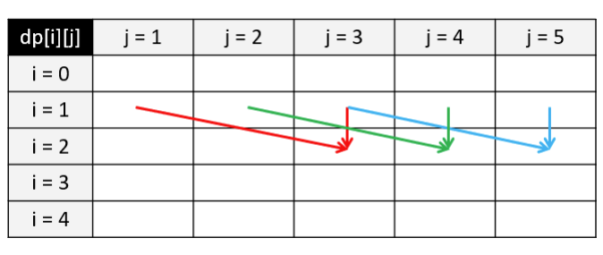
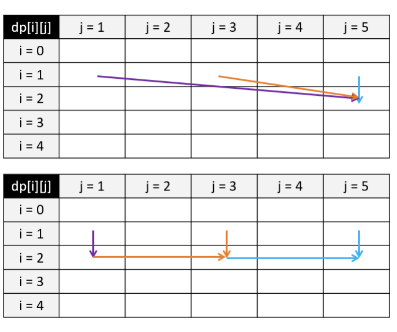

# 6.6 Knapsack Problem

The `knapsack problem` is a combinatorial optimization NP-complete problem: given n items and a knapsack with weight capacity w, where each item has a weight and a value, determine which items to include in the knapsack to maximize the total value. If each item can only be chosen 0 or 1 time, the problem is called the `0-1 knapsack problem`; if there is no limit to the number of items chosen, it is called the `unbounded knapsack problem`.

We can solve the knapsack problem using dynamic programming. Taking the 0-1 knapsack problem as an example, we define a 2D array `dp` to store the maximum value, where `dp[i][j]` represents the maximum value achievable with the first i items and a knapsack weight limit of j. When processing the i-th item, if we do not include item i in the knapsack, then `dp[i][j] = dp[i-1][j]`, which means the maximum value equals that of the first i-1 items. If we include item i, with weight `weight` and value `value`, then `dp[i][j] = dp[i-1][j-weight] + value`. We take the maximum of these two options during iteration, resulting in a time complexity and space complexity of $O(nw)$.


<Tabs>
<TabItem value="cpp" label="C++">

```cpp
int knapsack(vector<int> weights, vector<int> values, int n, int w) {
    vector<vector<int>> dp(n + 1, vector<int>(w + 1, 0));
    for (int i = 1; i <= n; ++i) {
        int weight = weights[i - 1], value = values[i - 1];
        for (int j = 1; j <= w; ++j) {
            if (j >= weight) {
                dp[i][j] = max(dp[i - 1][j], dp[i - 1][j - weight] + value);
            } else {
                dp[i][j] = dp[i - 1][j];
            }
        }
    }
    return dp[n][w];
}
```

</TabItem>
<TabItem value="py" label="Python">

```py
def knapsack(weights: List[int], values: List[int], n: int, w: int) -> int:
    dp = [[0 for _ in range(w + 1)] for _ in range(n + 1)]
    for i in range(1, n + 1):
        weight, value = weights[i - 1], values[i - 1]
        for j in range(1, w + 1):
            if j >= weight:
                dp[i][j] = max(dp[i - 1][j], dp[i - 1][j - weight] + value)
            else:
                dp[i][j] = dp[i - 1][j]
    return dp[n][w]
```

</TabItem>

</Tabs>

<figure>
  <span style={{ display: 'block', width: '75%', margin: '0 auto' }}>
    
  </span>
  <figcaption style={{ textAlign: 'center' }}>Figure 6.3: 0-1 Knapsack Problem - State Transition Matrix Example</figcaption>
</figure>

We can further optimize the space complexity of the 0-1 knapsack problem to $O(w)$. As shown in the figure, assume we are currently considering item $i = 2$, with a weight of $weight = 2$ and a value of $value = 3$. For a knapsack capacity of $j$, we have $dp[2][j] = max(dp[1][j], dp[1][j-2] + 3)$. Here, we observe that we always depend only on the information from the previous row $i = 1$, and the results of other items computed earlier are no longer needed. Therefore, we can remove the first dimension of the $dp$ matrix, reducing it to $dp[j] = max(dp[j], dp[j-weight] + value)$ when considering item $i$. It's important to note that we must **traverse in reverse order** for each row. This ensures that the value of $dp[j-weight]$ from the previous row (item $i-1$) is correctly accessed. If traversed in the forward direction (left to right), $dp[j-weight]$ would already be updated to the value of item $i$ before reaching $j$.

<Tabs>
<TabItem value="cpp" label="C++">

```cpp
int knapsack(vector<int> weights, vector<int> values, int n, int w) {
    vector<int> dp(w + 1, 0);
    for (int i = 1; i <= n; ++i) {
        int weight = weights[i - 1], value = values[i - 1];
        for (int j = w; j >= weight; --j) {
            dp[j] = max(dp[j], dp[j - weight] + value);
        }
    }
    return dp[w];
}
```

</TabItem>
<TabItem value="py" label="Python">

```py
def knapsack(weights: List[int], values: List[int], n: int, w: int) -> int:
    dp = [0] * (w + 1)
    for i in range(1, n + 1):
        weight, value = weights[i - 1], values[i - 1]
        for j in range(w, weight - 1, -1):
            dp[j] = max(dp[j], [j - weight] + value)
    return dp[w]
```

</TabItem>

</Tabs>

In the unbounded knapsack problem, an item can be chosen multiple times. As shown in the top part of the figure, assume we are processing item $i = 2$, with a weight of $weight = 2$ and a value of $value = 3$. For a knapsack capacity of $j = 5$, we can fit at most 2 of this item. Thus, our state transition equation becomes $dp[2][5] = max(dp[1][5], dp[1][3] + 3, dp[1][1] + 6)$. If we use this approach and assume infinite knapsack capacity with infinitely small item weight, the number of comparisons would approach infinity, far exceeding the time complexity of $O(nw)$.

<figure>
  <span style={{ display: 'block', width: '75%', margin: '0 auto' }}>
    
  </span>
  <figcaption style={{ textAlign: 'center' }}>Figure 6.4: Unbounded Knapsack Problem - State Transition Matrix Example</figcaption>
</figure>

How do we solve this issue? We observe that at $dp[2][3]$, we have already accounted for $dp[1][3]$ and $dp[2][1]$, and at $dp[2][1]$, we have already considered $dp[1][1]$. Therefore, as shown in the bottom part of the figure, for cases involving multiple items, we only need to consider $dp[2][3]$, i.e., $dp[2][5] = max(dp[1][5], dp[2][3] + 3)$. This gives us the state transition equation for the unbounded knapsack problem: $dp[i][j] = max(dp[i-1][j], dp[i][j-w] + v)$, which differs from the 0-1 knapsack problem only in that the second $i-1$ in the state transition equation is replaced by $i$.


<Tabs>
<TabItem value="cpp" label="C++">

```cpp
int knapsack(vector<int> weights, vector<int> values, int n, int w) {
    vector<vector<int>> dp(n + 1, vector<int>(w + 1, 0));
    for (int i = 1; i <= n; ++i) {
        int weight = weights[i - 1], value = values[i - 1];
        for (int j = 1; j <= w; ++j) {
            if (j >= weight) {
                dp[i][j] = max(dp[i - 1][j], dp[i][j - weight] + value);
            } else {
                dp[i][j] = dp[i - 1][j];
            }
        }
    }
    return dp[n][w];
}
```

</TabItem>
<TabItem value="py" label="Python">

```py
def knapsack(weights: List[int], values: List[int], n: int, w: int) -> int:
    dp = [[0 for _ in range(w + 1)] for _ in range(n + 1)]
    for i in range(1, n + 1):
        weight, value = weights[i - 1], values[i - 1]
        for j in range(1, w + 1):
            if j >= weight:
                dp[i][j] = max(dp[i - 1][j], dp[i][j - weight] + value)
            else:
                dp[i][j] = dp[i - 1][j]
    return dp[n][w]
```

</TabItem>

</Tabs>

Similarly, we can use space optimization to reduce the time complexity to $O(w)$. It is important to note that during each row traversal, we must perform a `forward traversal`, as we need to use the information of the current item at column $j-weight$.

<Tabs>
<TabItem value="cpp" label="C++">

```cpp
int knapsack(vector<int> weights, vector<int> values, int n, int w) {
    vector<int> dp(w + 1, 0);
    for (int i = 1; i <= n; ++i) {
        int weight = weights[i - 1], value = values[i - 1];
        for (int j = weight; j <= w; ++j) {
            dp[j] = max(dp[j], dp[j - weight] + value);
        }
    }
    return dp[w];
}
```

</TabItem>
<TabItem value="py" label="Python">

```py
def knapsack(weights: List[int], values: List[int], n: int, w: int) -> int:
    dp = [0] * (w + 1)
    for i in range(1, n + 1):
        weight, value = weights[i - 1], values[i - 1]
        for j in range(weight, w + 1):
            dp[j] = max(dp[j], [j - weight] + value)
    return dp[w]
```

</TabItem>

</Tabs>

:::warning

When compressing space, should we use `forward` or `backward` traversal? Should items or weights be placed in the outer loop? This depends on the dependency relationships in the state transition equation. Before considering space compression, it is helpful to draw the state transition matrix to better understand how to compress space and which dimension to compress for optimal efficiency.

:::

## [416. Partition Equal Subset Sum](https://leetcode.com/problems/partition-equal-subset-sum/)

### Problem Description

Given a positive integer array, determine whether it can be partitioned into two subsets with equal sums.

### Input and Output Example

The input is a one-dimensional positive integer array, and the output is a boolean value indicating whether the array can be partitioned as required.

```
Input: [1,5,11,5]
Output: true
```

In this example, the array can be partitioned into [1,5,5] and [11].

### Solution Explanation

This problem is equivalent to the 0-1 knapsack problem. Given the total sum of all numbers, `sum`, the goal is to find a subset of numbers whose total equals `sum / 2`. Since there is no need to consider values, a boolean matrix can be used to represent the state transition matrix. Pay attention to the handling of boundary conditions.

<Tabs>
<TabItem value="cpp" label="C++">

```cpp
bool canPartition(vector<int> &nums) {
    int nums_sum = accumulate(nums.begin(), nums.end(), 0);
    if (nums_sum % 2 != 0) {
        return false;
    }
    int target = nums_sum / 2, n = nums.size();
    vector<vector<bool>> dp(n + 1, vector<bool>(target + 1, false));
    dp[0][0] = true;
    for (int i = 1; i <= n; ++i) {
        for (int j = 0; j <= target; ++j) {
            if (j < nums[i - 1]) {
                dp[i][j] = dp[i - 1][j];
            } else {
                dp[i][j] = dp[i - 1][j] || dp[i - 1][j - nums[i - 1]];
            }
        }
    }
    return dp[n][target];
}
```

</TabItem>
<TabItem value="py" label="Python">

```py
def canPartition(nums: List[int]) -> bool:
    nums_sum = sum(nums)
    if nums_sum % 2 != 0:
        return False
    target, n = nums_sum // 2, len(nums)
    dp = [[False for _ in range(target + 1)] for _ in range(n + 1)]
    dp[0][0] = True
    for i in range(1, n + 1):
        for j in range(target + 1):
            if j < nums[i - 1]:
                dp[i][j] = dp[i - 1][j]
            else:
                dp[i][j] = dp[i - 1][j] or dp[i - 1][j - nums[i - 1]]
    return dp[n][target]
```

</TabItem>

</Tabs>

Similarly, we can perform space compression for this problem. Note that the traversal of the sum of numbers needs to be in reverse order.

<Tabs>
<TabItem value="cpp" label="C++">

```cpp
bool canPartition(vector<int> &nums) {
    int nums_sum = accumulate(nums.begin(), nums.end(), 0);
    if (nums_sum % 2 != 0) {
        return false;
    }
    int target = nums_sum / 2, n = nums.size();
    vector<bool> dp(target + 1, false);
    dp[0] = true;
    for (int i = 1; i <= n; ++i) {
        for (int j = target; j >= nums[i - 1]; --j) {
            dp[j] = dp[j] || dp[j - nums[i - 1]];
        }
    }
    return dp[target];
}
```

</TabItem>
<TabItem value="py" label="Python">

```py
def canPartition(nums: List[int]) -> bool:
    nums_sum = sum(nums)
    if nums_sum % 2 != 0:
        return False
    target, n = nums_sum // 2, len(nums)
    dp = [True] + [False] * target
    for i in range(1, n + 1):
        for j in range(target, nums[i - 1] - 1, -1):
            dp[j] = dp[j] or dp[j - nums[i - 1]]
    return dp[target]
```

</TabItem>

</Tabs>

## [474. Ones and Zeroes](https://leetcode.com/problems/ones-and-zeroes/)

### Problem Description

Given $m$ zeros and $n$ ones, and an array of binary strings, determine the maximum number of given strings that can be formed using these zeros and ones, with each string being used at most once.

### Input and Output Example

Input consists of two integers $m$ and $n$, representing the count of zeros and ones respectively, along with a one-dimensional array of strings representing the strings to form;
Output is an integer representing the maximum number of strings that can be formed.

```
Input: Array = {"10", "0001", "111001", "1", "0"}, m = 5, n = 3
Output: 4
```

In this example, we can use 5 zeros and 3 ones to form [“10”, “0001”, “1”, “0”].

### Solution Explanation

This is a multidimensional 0-1 knapsack problem, where there are two constraints: the number of zeros and the number of ones. Below is the implementation of compressing the three-dimensional solution into a two-dimensional space.

<Tabs>
<TabItem value="cpp" label="C++">

```cpp
int findMaxForm(vector<string>& strs, int m, int n) {
    vector<vector<int>> dp(m + 1, vector<int>(n + 1, 0));
    for (const string& s : strs) {
        int zeros = 0, ones = 0;
        for (char c : s) {
            if (c == ’0’) {
                ++zeros;
            } else {
                ++ones;
            }
        }
        for (int i = m; i >= zeros; --i) {
            for (int j = n; j >= ones; --j) {
                dp[i][j] = max(dp[i][j], dp[i - zeros][j - ones] + 1);
            }
        }
    }
    return dp[m][n];
}
```

</TabItem>
<TabItem value="py" label="Python">

```py
def findMaxForm(strs: List[str], m: int, n: int) -> int:
    dp = [[0 for _ in range(n + 1)] for _ in range(m + 1)]
    for s in strs:
        zeros = len(list(filter(lambda c: c == "0", s)))
        ones = len(s) - zeros
        for i in range(m, zeros - 1, -1):
            for j in range(n, ones - 1, -1):
                dp[i][j] = max(dp[i][j], dp[i - zeros][j - ones] + 1)
    return dp[m][n]
```

</TabItem>

</Tabs>

## [322. Coin Change](https://leetcode.com/problems/coin-change/)

### Problem Description

Given a list of coin denominations, find the minimum number of coins required to make up a given amount.

### Input and Output Example

Input is a one-dimensional integer array representing coin denominations and an integer representing the target amount. Output is an integer indicating the minimum number of coins required. If no solution exists, return -1.

```
Input: coins = [1, 2, 5], amount = 11
Output: 3
```

In this example, the minimum combination is 11 = 5 + 5 + 1.

### Solution Explanation

Since each coin can be used an unlimited number of times, this problem is essentially an unbounded knapsack problem. Below is the implementation using one-dimensional space compression.

Note: The `dp` array is initialized to `amount + 1` instead of `-1` because the dynamic programming process involves taking the minimum. If initialized to `-1`, the result would always be `-1`. The choice of `amount + 1` is because the maximum possible number of coins is `amount` (using only 1-value coins), so this value is guaranteed to be greater than any valid combination. If the result remains `amount + 1` after the DP process, it means no valid combination exists, and we return `-1`.

<Tabs>
<TabItem value="cpp" label="C++">

```cpp
int coinChange(vector<int>& coins, int amount) {
    vector<int> dp(amount + 1, amount + 1);
    dp[0] = 0;
    for (int i = 1; i <= amount; ++i) {
        for (int coin : coins) {
            if (i >= coin) {
                dp[i] = min(dp[i], dp[i - coin] + 1);
            }
        }
    }
    return dp[amount] != amount + 1 ? dp[amount] : -1;
}
```

</TabItem>
<TabItem value="py" label="Python">

```py
def coinChange(coins: List[int], amount: int) -> int:
    dp = [0] + [amount + 1] * amount
    for i in range(1, amount + 1):
        for coin in coins:
            if i >= coin:
                dp[i] = min(dp[i], dp[i - coin] + 1)
    return dp[amount] if dp[amount] != amount + 1 else -1
```

</TabItem>

</Tabs>