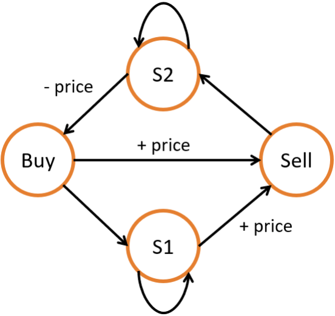

# 6.8 股票交易

`股票交易`类问题通常可以用动态规划来解决。对于稍微复杂一些的股票交易类问题，比如需要冷却时间或者交易费用，则可以用通过动态规划实现的`状态机`来解决。

## [121. Best Time to Buy and Sell Stock](https://leetcode.com/problems/best-time-to-buy-and-sell-stock/)

### Problem Description

给定一段时间内每天某只股票的固定价格，已知你只可以买卖各一次，求最大的收益。

### Input and Output Example

输入一个一维整数数组，表示每天的股票价格；输出一个整数，表示最大的收益。

```
Input: [7,1,5,3,6,4]
Output: 5
```

在这个样例中，最大的利润为在第二天价格为 1 时买入，在第五天价格为 6 时卖出。

### Solution Explanation

我们可以遍历一遍数组，在每一个位置 i 时，记录 i 位置之前所有价格中的最低价格，然后将当前的价格作为售出价格，查看当前收益是不是最大收益即可。注意本题中以及之后题目中的buy 和 sell 表示买卖操作时，用户账户的收益。因此买时为负，卖时为正。

<Tabs>
<TabItem value="cpp" label="C++">

```cpp
int maxProfit(vector<int>& prices) {
    int buy = numeric_limits<int>::lowest(), sell = 0;
    for (int price : prices) {
        buy = max(buy, -price);
        sell = max(sell, buy + price);
    }
    return sell;
}
```

</TabItem>
<TabItem value="py" label="Python">

```py
def maxProfit(prices: List[int]) -> int:
    buy, sell = -sys.maxsize, 0
    for price in prices:
        buy = max(buy, -price)
        sell = max(sell, buy + price)
    return sell
```

</TabItem>

</Tabs>

## [188. Best Time to Buy and Sell Stock IV](https://leetcode.com/problems/best-time-to-buy-and-sell-stock-iv/)

### Problem Description

给定一段时间内每天某只股票的固定价格，已知你只可以买卖各 $k$ 次，且每次只能拥有一支股票，求最大的收益。

### Input and Output Example

输入一个一维整数数组，表示每天的股票价格；以及一个整数，表示可以买卖的次数 $k$。输出一个整数，表示最大的收益。

```
Input: [3,2,6,5,0,3], k = 2
Output: 7
```

在这个样例中，最大的利润为在第二天价格为 2 时买入，在第三天价格为 6 时卖出；再在第五天价格为 0 时买入，在第六天价格为 3 时卖出。

### Solution Explanation

类似地，我们可以建立两个动态规划数组 buy 和 sell，对于每天的股票价格，buy[j] 表示在第 j 次买入时的最大收益，sell[j] 表示在第 j 次卖出时的最大收益。


<Tabs>
<TabItem value="cpp" label="C++">

```cpp
int maxProfit(int k, vector<int>& prices) {
    int days = prices.size();
    vector<int> buy(k + 1, numeric_limits<int>::lowest()), sell(k + 1, 0);
    for (int i = 0; i < days; ++i) {
        for (int j = 1; j <= k; ++j) {
            buy[j] = max(buy[j], sell[j - 1] - prices[i]);
            sell[j] = max(sell[j], buy[j] + prices[i]);
        }
    }
    return sell[k];
}
```

</TabItem>
<TabItem value="py" label="Python">

```py
def maxProfit(k: int, prices: List[int]) -> int:
    days = len(prices)
    buy, sell = [-sys.maxsize] * (k + 1), [0] * (k + 1)
    for i in range(days):
        for j in range(1, k + 1):
            buy[j] = max(buy[j], sell[j - 1] - prices[i])
            sell[j] = max(sell[j], buy[j] + prices[i])
    return sell[k]
```

</TabItem>

</Tabs>

## [309. Best Time to Buy and Sell Stock with Cooldown](https://leetcode.com/problems/best-time-to-buy-and-sell-stock-with-cooldown/)

### Problem Description

给定一段时间内每天某只股票的固定价格，已知每次卖出之后必须冷却一天，且每次只能拥有一支股票，求最大的收益。

### Input and Output Example

输入一个一维整数数组，表示每天的股票价格；输出一个整数，表示最大的收益。

```
Input: [1,2,3,0,2]
Output: 3
```

在这个样例中，最大的利润获取操作是买入、卖出、冷却、买入、卖出。

### Solution Explanation

我们可以使用状态机来解决这类复杂的状态转移问题，通过建立多个状态以及它们的转移方式，我们可以很容易地推导出各个状态的转移方程。如图所示，我们可以建立四个状态来表示带有冷却的股票交易，以及它们的之间的转移方式。

<figure>
  <span style={{ display: 'block', width: '40%', margin: '0 auto' }}>
    
  </span>
  <figcaption style={{ textAlign: 'center' }}>图 6.5: 题目 309 - 状态机状态转移</figcaption>
</figure>

<Tabs>
<TabItem value="cpp" label="C++">

```cpp
int maxProfit(vector<int>& prices) {
    int n = prices.size();
    vector<int> buy(n), sell(n), s1(n), s2(n);
    s1[0] = buy[0] = -prices[0];
    sell[0] = s2[0] = 0;
    for (int i = 1; i < n; ++i) {
        buy[i] = s2[i - 1] - prices[i];
        s1[i] = max(buy[i - 1], s1[i - 1]);
        sell[i] = max(buy[i - 1], s1[i - 1]) + prices[i];
        s2[i] = max(s2[i - 1], sell[i - 1]);
    }
    return max(sell[n - 1], s2[n - 1]);
}
```

</TabItem>
<TabItem value="py" label="Python">

```py
def maxProfit(prices: List[int]) -> int:
    n = len(prices)
    buy, sell, s1, s2 = [0] * n, [0] * n, [0] * n, [0] * n
    s1[0] = buy[0] = -prices[0]
    sell[0] = s2[0] = 0
    for i in range(1, n):
        buy[i] = s2[i - 1] - prices[i]
        s1[i] = max(buy[i - 1], s1[i - 1])
        sell[i] = max(buy[i - 1], s1[i - 1]) + prices[i]
        s2[i] = max(s2[i - 1], sell[i - 1])
    return max(sell[n - 1], s2[n - 1])
```

</TabItem>

</Tabs>