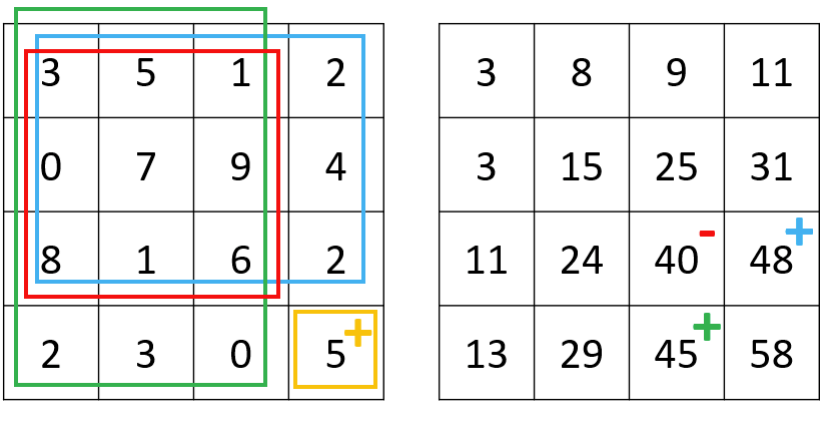
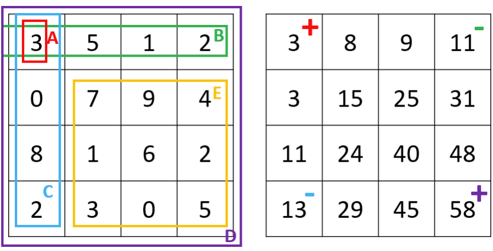

# 10.10 前綴和與積分圖

一維的前綴和（cumulative sum, cumsum），二維的積分圖（summed-area table, image integral）是通過將每個位置之前的一維線段或二維矩形的數值預先計算並儲存，從而加速後續的查詢與計算。如果需要對前綴和或積分圖的值進行查找，可以將其存入雜湊表；如果需要對每個位置記錄前綴和或積分圖的值，則可以將其儲存到一維或二維數組中，通常還伴隨著動態規劃。

## [303. Range Sum Query - Immutable](https://leetcode.com/problems/range-sum-query-immutable/)

### 題目描述

設計一個資料結構，使得其能夠快速查詢給定陣列中任意兩個位置間所有數字的總和。

### 輸入輸出範例

以下是資料結構的調用範例。

```
vector<int> nums{-2,0,3,-5,2,-1};
NumArray num_array = new NumArray(nums);
num_array.sumRange(0,2); // Result = -2+0+3 = 1.
num_array.sunRange(1,5); // Result = 0+3-5+2-1 = -1.
```

### 題解

對於一維的陣列，我們可以使用前綴和來解決此類問題。先建立一個與陣列 `nums` 長度相同的新陣列 `cumsum`，表示 `nums` 每個位置之前所有數字的總和。`cumsum` 陣列可以通過 C++ 自帶的 `partial_sum` 函數建立，也可以直接遍歷一遍 `nums` 陣列，並利用狀態轉移方程 `cumsum[i] = cumsum[i-1] + nums[i]` 完成統計。如果我們需要獲得位置 `i` 和 `j` 之間的數字和，只需計算 `cumsum[j+1] - cumsum[i]` 即可。

<Tabs>
<TabItem value="cpp" label="C++">

```cpp
class NumArray {
   public:
    NumArray(vector<int> nums) : cumsum_(nums.size() + 1, 0) {
        partial_sum(nums.begin(), nums.end(), cumsum_.begin() + 1);
    }

    int sumRange(int left, int right) {
        return cumsum_[right + 1] - cumsum_[left];
    }

   private:
    vector<int> cumsum_;
};
```

</TabItem>
<TabItem value="py" label="Python">

```py
class NumArray:
    def __init__(self, nums: List[int]):
        self.cumsum = [0] + nums[:]
        for i in range(2, len(self.cumsum)):
            self.cumsum[i] += self.cumsum[i - 1]

    def sumRange(self, left: int, right: int) -> int:
        return self.cumsum[right + 1] - self.cumsum[left]
```

</TabItem>

</Tabs>

## [304. Range Sum Query 2D - Immutable](https://leetcode.com/problems/range-sum-query-2d-immutable/)

### 題目描述

設計一個資料結構，使得其能夠快速查詢給定矩陣中，任意兩個位置包圍的長方形中所有數字的總和。

### 輸入輸出範例

以下是資料結構的調用範例。其中 `sumRegion` 函數的四個輸入分別是第一個點的橫、縱坐標，和第二個點的橫、縱坐標。

```
vector<int> matrix{{3,0,1,4,2},
 {5,6,3,2,1},
 {1,2,0,1,5},
 {4,1,0,1,7},
 {1,0,3,0,5}
};
NumMatrix num_matrix = new NumMatrix(matrix);
num_matrix.sumRegion(2,1,4,3); // Result = 8.
num_matrix.sumRegion(1,1,2,2); // Result = 11.
```

### 題解

類似於前綴和，我們可以把這種思想拓展到二維，即積分圖（summed-area table, image integral）。我們可以先建立一個 `sat` 矩陣，`sat[i][j]` 表示以位置 `(0, 0)` 為左上角、位置 `(i-1, j-1)` 為右下角的長方形中所有數字的總和。

<figure>
  <span style={{ display: 'block', width: '60%', margin: '0 auto' }}>
    
  </span>
  <figcaption style={{ textAlign: 'center' }}>圖 10.4: 題目 304 - 圖 1 - 左邊為給定矩陣，右邊為積分圖結果，右下角位置的積分圖值為 5+48+45−40 = 58</figcaption>
</figure>


<figure>
  <span style={{ display: 'block', width: '60%', margin: '0 auto' }}>
    
  </span>
  <figcaption style={{ textAlign: 'center' }}>圖 10.5: 題目 304 - 圖 2 - 左邊為給定矩陣，右邊為積分圖結果，長方形 E 的數字總和等於 58 − 11 − 13 + 3 = 37</figcaption>
</figure>

如圖 1 所示，我們可以用動態規劃來計算 `sat` 矩陣：`sat[i][j] = matrix[i-1][j-1] + sat[i-1][j] + sat[i][j-1] - sat[i-1][j-1]`，即當前座標的數字 + 上面長方形的數字總和 + 左邊長方形的數字總和 - 上面長方形和左邊長方形重疊區域（即左上一格的長方形）中的數字總和。

如圖 2 所示，假設我們要查詢長方形 E 的數字總和，因為 `E = D − B − C + A`，我們發現 E 其實可以由四個位置的積分圖結果進行加減運算得到。因此這個演算法在預處理時的時間複雜度為 $O(mn)$，而在查詢時的時間複雜度僅為 $O(1)$。

<Tabs>
<TabItem value="cpp" label="C++">

```cpp
class NumMatrix {
   public:
    NumMatrix(vector<vector<int>> matrix) {
        int m = matrix.size(), n = matrix[0].size();
        sat_ = vector<vector<int>>(m + 1, vector<int>(n + 1, 0));
        for (int i = 1; i <= m; ++i) {
            for (int j = 1; j <= n; ++j) {
                sat_[i][j] = matrix[i - 1][j - 1] + sat_[i - 1][j] +
                             sat_[i][j - 1] - sat_[i - 1][j - 1];
            }
        }
    }

    int sumRegion(int row1, int col1, int row2, int col2) {
        return sat_[row2 + 1][col2 + 1] - sat_[row2 + 1][col1] -
               sat_[row1][col2 + 1] + sat_[row1][col1];
    }

   private:
    vector<vector<int>> sat_;
};
```

</TabItem>
<TabItem value="py" label="Python">

```py
class NumMatrix:
    def __init__(self, matrix: List[List[int]]):
        m, n = len(matrix), len(matrix[0])
        self.sat = [[0 for _ in range(n + 1)] for _ in range(m + 1)]
        
        for i in range(1, m + 1):
            for j in range(1, n + 1):
                self.sat[i][j] = (
                    matrix[i - 1][j - 1]
                    + self.sat[i - 1][j]
                    + self.sat[i][j - 1]
                    - self.sat[i - 1][j - 1]
                )

    def sumRegion(self, row1: int, col1: int, row2: int, col2: int) -> int:
        return (
            self.sat[row2 + 1][col2 + 1]
            - self.sat[row2 + 1][col1]
            - self.sat[row1][col2 + 1]
            + self.sat[row1][col1]
        )

```

</TabItem>

</Tabs>

## [560. Subarray Sum Equals K](https://leetcode.com/problems/subarray-sum-equals-k/)

### 題目描述

給定一個陣列，尋找和為 $k$ 的連續子陣列個數。

### 輸入輸出範例

輸入是一維整數陣列和一個整數值 $k$；輸出是一個整數，表示滿足條件的連續子陣列個數。

```
Input: nums = [1,1,1], k = 2
Output: 2
```

在這個範例中，我們可以找到兩個 [1,1] 連續子陣列滿足條件。

### 題解

本題同樣是利用前綴和，不同的是這裡我們使用一個雜湊表 `cache`，其鍵是前綴和，而值是該前綴和出現的次數。在我們遍歷到位置 $i$ 時，假設當前的前綴和是 `cumsum`，那麼 `cache[cumsum-k]` 即為以當前位置結尾、滿足條件的子陣列個數。

<Tabs>
<TabItem value="cpp" label="C++">

```cpp
int subarraySum(vector<int>& nums, int k) {
    int count = 0, cumsum = 0;
    unordered_map<int, int> cache;  // <cumsum, frequency>
    cache[0] = 1;
    for (int num : nums) {
        cumsum += num;
        count += cache[cumsum - k];
        ++cache[cumsum];
    }
    return count;
}
```

</TabItem>
<TabItem value="py" label="Python">

```py
def subarraySum(nums: List[int], k: int) -> int:
    count, cur_sum = 0, 0
    cache = {0: 1} # <cumsum, frequency>
    for num in nums:
        cur_sum += num
        count += cache.get(cur_sum - k, 0)
        cache[cur_sum] = cache.get(cur_sum, 0) + 1
    return count
```

</TabItem>

</Tabs>

