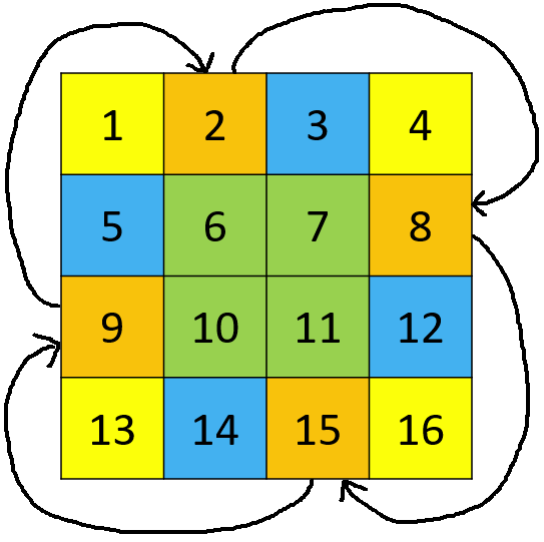

# 10.3 陣列

## [448. Find All Numbers Disappeared in an Array](https://leetcode.com/problems/find-all-numbers-disappeared-in-an-array/)

### 題目描述

給定一個長度為 n 的陣列，其中包含範圍為 1 到 n 的整數，有些整數重複出現多次，有些整數沒有出現，求 1 到 n 中沒有出現過的整數。

### 輸入輸出範例

輸入是一個一維整數陣列，輸出也是一個一維整數陣列，表示輸入陣列中沒出現過的數字。

```
Input: [4,3,2,7,8,2,3,1]
Output: [5,6]
```

利用陣列這種資料結構建立 n 個桶，把所有重複出現的位置進行標記，然後再遍歷一遍陣列，即可找到沒有出現過的數字。進一步地，我們可以直接對原陣列進行標記：把重複出現的數字在原陣列的位置設為負數（這裡負數的目的是把 1 到 n 的數字映射到 0 到 n-1 的位置），最後仍然為正數的位置即為沒有出現過的數。

### 題解

<Tabs>
<TabItem value="cpp" label="C++">

```cpp
vector<int> findDisappearedNumbers(vector<int>& nums) {
    vector<int> disappeared;
    for (int num : nums) {
        int pos = abs(num) - 1;
        if (nums[pos] > 0) {
            nums[pos] = -nums[pos];
        }
    }
    for (int i = 0; i < nums.size(); ++i) {
        if (nums[i] > 0) {
            disappeared.push_back(i + 1);
        }
    }
    return disappeared;
}
```

</TabItem>
<TabItem value="py" label="Python">

```py
def findDisappearedNumbers(nums: List[int]) -> List[int]:
    for num in nums:
        pos = abs(num) - 1
        if nums[pos] > 0:
            nums[pos] = -nums[pos]
    return [i + 1 for i in range(len(nums)) if nums[i] > 0]
```

</TabItem>

</Tabs>

## [48. Rotate Image](https://leetcode.com/problems/rotate-image/)

### 題目描述

給定一個 n × n 的矩陣，求它順時針旋轉 90 度的結果，且必須在原矩陣上修改（in-place）。怎樣能夠盡量不創建額外儲存空間呢？

### 輸入輸出範例

輸入和輸出都是一個二維整數矩陣。

```
Input:
[[1,2,3],
 [4,5,6],
 [7,8,9]]
Output:
[[7,4,1],
 [8,5,2],
 [9,6,3]]
```

### 題解

每次只考慮四個間隔 90 度的位置，可以進行 $O(1)$ 額外空間的旋轉。

<figure>
  <span style={{ display: 'block', width: '30%', margin: '0 auto' }}>
    
  </span>
  <figcaption style={{ textAlign: 'center' }}>圖 10.1: 題目 48 - $O(1)$ 空間旋轉範例，相同顏色代表四個互相交換的位置</figcaption>
</figure>

<Tabs>
<TabItem value="cpp" label="C++">

```cpp
void rotate(vector<vector<int>>& matrix) {
    int pivot = 0, n = matrix.size() - 1;
    for (int i = 0; i <= n / 2; ++i) {
        for (int j = i; j < n - i; ++j) {
            pivot = matrix[j][n - i];
            matrix[j][n - i] = matrix[i][j];
            matrix[i][j] = matrix[n - j][i];
            matrix[n - j][i] = matrix[n - i][n - j];
            matrix[n - i][n - j] = pivot;
        }
    }
}
```

</TabItem>
<TabItem value="py" label="Python">

```py
def rotate(matrix: List[List[int]]) -> None:
    n = len(matrix) - 1
    for i in range(n // 2 + 1):
        for j in range(i, n - i):
            pivot = matrix[j][n - i]
            matrix[j][n - i] = matrix[i][j]
            matrix[i][j] = matrix[n - j][i]
            matrix[n - j][i] = matrix[n - i][n - j]
            matrix[n - i][n - j] = pivot
```

</TabItem>

</Tabs>

## [240. Search a 2D Matrix II](https://leetcode.com/problems/search-a-2d-matrix-ii/)

### 題目描述

給定一個二維矩陣，已知每行和每列都是遞增排序，嘗試設計一個快速搜索某個數字是否存在於矩陣中的演算法。

### 輸入輸出範例

輸入是一個二維整數矩陣，和一個待搜索整數。輸出是一個布林值，表示該整數是否存在於矩陣中。

```
Input: matrix =
[ [1, 4, 7, 11, 15],
  [2, 5, 8, 12, 19],
  [3, 6, 9, 16, 22],
  [10, 13, 14, 17, 24],
  [18, 21, 23, 26, 30]], target = 5
Output: true
```

### 題解

這道題有一個簡單的技巧：我們可以從右上角開始查找，若當前值大於待搜索值，我們向左移動一位；若當前值小於待搜索值，我們向下移動一位。如果最終移動到左下角時仍不等於待搜索值，則說明該值不存在於矩陣中。

<Tabs>
<TabItem value="cpp" label="C++">

```cpp
bool searchMatrix(vector<vector<int>>& matrix, int target) {
    int m = matrix.size(), n = matrix[0].size();
    int i = 0, j = n - 1;
    while (i < m && j >= 0) {
        if (matrix[i][j] == target) {
            return true;
        } else if (matrix[i][j] < target) {
            ++i;
        } else {
            --j;
        }
    }
    return false;
}
```

</TabItem>
<TabItem value="py" label="Python">

```py
def searchMatrix(matrix: List[List[int]], target: int) -> bool:
    m, n = len(matrix), len(matrix[0])
    i, j = 0, n - 1
    while i < m and j >= 0:
        if matrix[i][j] == target:
            return True
        if matrix[i][j] < target:
            i += 1
        else:
            j -= 1
    return False
```

</TabItem>

</Tabs>

## [769. Max Chunks To Make Sorted](https://leetcode.com/problems/max-chunks-to-make-sorted/)

### 題目描述

給定一個包含 0 到 n 的整數陣列，每個整數只出現一次，求這個陣列最多可以分割成多少個子陣列，使得對每個子陣列進行遞增排序後，原陣列也是遞增的。

### 輸入輸出範例

輸入是一個一維整數陣列，輸出是一個整數，表示最多的分割數。

```
Input: [1,0,2,3,4]
Output: 4
```

在這個範例中，最多的分割是 [1, 0], [2], [3], [4]。

### 題解

從左到右遍歷，同時記錄目前的最大值，每當目前最大值等於目前陣列位置時，我們可以進行一次分割。

為什麼這個演算法可以解決問題呢？如果目前最大值大於目前陣列位置，則說明右邊一定有小於目前位置的數字，需要把它也加入待排序的子陣列；又因為陣列只包含不重複的 0 到 n，所以目前最大值一定不會小於目前陣列位置。因此，每當目前最大值等於目前陣列位置時，假設為 p，我們可以成功完成一次分割，並且其與上一次分割位置 q 之間的值一定是 q+1 到 p 的所有數字。

<Tabs>
<TabItem value="cpp" label="C++">

```cpp
int maxChunksToSorted(vector<int>& arr) {
    int chunks = 0, cur_max = 0;
    for (int i = 0; i < arr.size(); ++i) {
        cur_max = max(cur_max, arr[i]);
        chunks += cur_max == i;
    }
    return chunks;
}
```

</TabItem>
<TabItem value="py" label="Python">

```py
def maxChunksToSorted(arr: List[int]) -> int:
    chunks, cur_max = 0, 0
    for i, num in enumerate(arr):
        cur_max = max(cur_max, num)
        chunks += cur_max == i
    return chunks
```

</TabItem>

</Tabs>