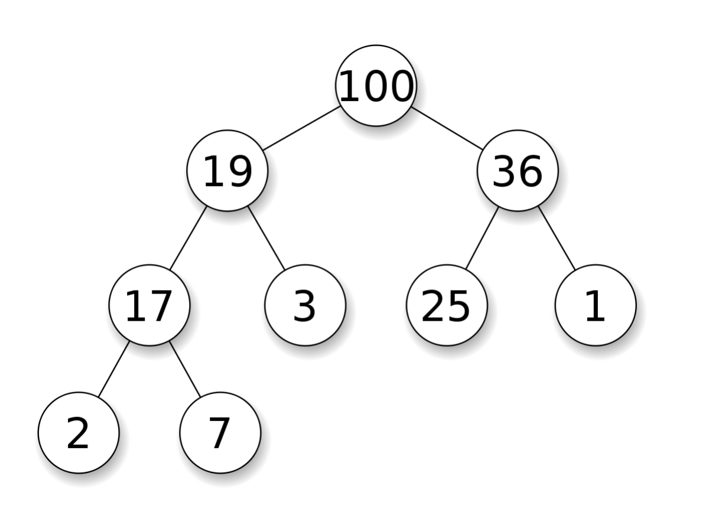
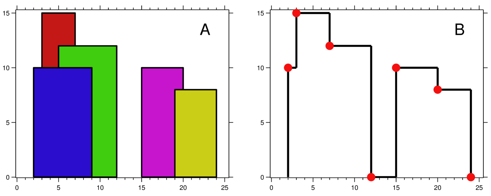

# 10.6 優先佇列

`優先佇列`（priority queue）可以在 $O(1)$ 時間內獲得最大值，並且可以在 $O(\log n)$ 時間內取出最大值或插入任意值。


<figure>
  <span style={{ display: 'block', width: '50%', margin: '0 auto' }}>
    
  </span>
  <figcaption style={{ textAlign: 'center' }}>圖 10.2: （最大）堆，維護的是資料結構中的大於關係</figcaption>
</figure>

優先佇列常常用堆（heap）來實現。堆是一個完全二元樹，其每個節點的值總是大於等於子節點的值。實際實現堆時，我們通常用一個陣列而不是用指標建立一個樹。這是因為堆是完全二元樹，所以用陣列表示時，位置 $i$ 的節點的父節點位置一定為 $(i-1)/2$，而它的兩個子節點的位置又一定分別為 $2i+1$ 和 $2i+2$。

以下是堆的實現方法，其中最核心的兩個操作是上浮和下沉：如果一個節點比父節點大，那麼需要交換這兩個節點；交換後還可能比它新的父節點大，因此需要不斷地進行比較和交換操作，我們稱之為上浮；類似地，如果一個節點比父節點小，也需要不斷地向下進行比較和交換操作我們稱之為下沉。如果一個節點有兩個子節點，我們總是交換最大的子節點。


<Tabs>
<TabItem value="cpp" label="C++">

```cpp
class Heap {
   public:
    Heap() {}
    // 上浮。
    void swim(int pos) {
        int next_pos = (pos - 1) / 2;
        while (pos > 0 && heap_[next_pos] < heap_[pos]) {
            swap(heap_[next_pos], heap_[pos]);
            pos = next_pos;
            next_pos = (pos - 1) / 2;
        }
    }
    // 下沉。
    void sink(int pos) {
        int n = heap_.size();
        int next_pos = 2 * pos + 1;
        while (next_pos < n) {
            if (next_pos < n - 1 && heap_[next_pos] < heap_[next_pos + 1]) {
                ++next_pos;
            }
            if (heap_[pos] >= heap_[next_pos]) {
                break;
            }
            swap(heap_[next_pos], heap_[pos]);
            pos = next_pos;
            next_pos = 2 * pos + 1;
        }
    }
    // 插入任意值：把新的數字放在最後一位，然後上浮。
    void push(int k) {
        heap_.push_back(k);
        swim(heap_.size() - 1);
    }
    // 刪除最大值：把最後一個數字挪到開頭，然後下沉。
    void pop() {
        heap_[0] = heap_.back();
        heap_.pop_back();
        sink(0);
    }
    // 獲得最大值。
    int top() { return heap_[0]; }

   private:
    vector<int> heap_;
};
```

</TabItem>
<TabItem value="py" label="Python">

```py
class Heap:
    def __init__(self):
        self.heap = []

    # 上浮。
    def swim(self, pos: int):
        next_pos = (pos - 1) // 2
        while pos > 0 and self.heap[next_pos] < self.heap[pos]:
            self.heap[next_pos], self.heap[pos] = self.heap[pos], self.heap[next_pos]
            pos = next_pos
            next_pos = (pos - 1) // 2

    # 下沉。
    def sink(self, pos: int):
        n = len(self.heap)
        next_pos = 2 * pos + 1
        while next_pos < n:
            if next_pos < n - 1 and self.heap[next_pos] < self.heap[next_pos + 1]:
                next_pos += 1
            if self.heap[pos] >= self.heap[next_pos]:
                break
            self.heap[next_pos], self.heap[pos] = self.heap[pos], self.heap[next_pos]
            pos = next_pos
            next_pos = 2 * pos + 1

    # 插入任意值：把新的數字放在最後一位，然後上浮。
    def push(self, k: int):
        self.heap.append(k)
        self.swim(len(self.heap) - 1)

    # 刪除最大值：把最後一個數字挪到開頭，然後下沉。
    def pop(self):
        self.heap[0] = self.heap.pop()
        self.sink(0)

    # 獲得最大值。
    def top(self) -> int:
        return self.heap[0]

```

</TabItem>

</Tabs>

通過將算法中的大於號和小於號互換，我們也可以得到一個快速獲得最小值的優先佇列。

## [23. Merge k Sorted Lists](https://leetcode.com/problems/merge-k-sorted-lists/)

### 題目描述

給定 k 個遞增的鏈結串列，嘗試將它們合併成一條遞增鏈結串列。

### 輸入輸出範例

輸入是一維陣列，每個位置儲存鏈結串列的頭節點；輸出是一條鏈結串列。

```
Input:
[1->4->5,
 1->3->4,
 2->6]
Output: 1->1->2->3->4->4->5->6
```

### 題解

本題可以有多種解法，例如類似於合併排序進行兩兩合併。我們這裡展示一個速度較快的方法，即把所有的鏈結串列存入一個優先佇列中，每次提取所有鏈結串列頭部節點值中最小的那個節點，直到所有鏈結串列都被提取完為止。

由於 C++ priority_queue 的比較函數預設是對最大堆進行比較並維持遞增關係，如果我們想要獲取最小的節點值，我們則需要實現一個最小堆。因此，堆的比較函數應該維持遞減關係，即 lambda 函數中返回時用大於號而不是遞增關係時的小於號進行比較。

<Tabs>
<TabItem value="cpp" label="C++">

```cpp
ListNode* mergeKLists(vector<ListNode*>& lists) {
    auto comp = [](ListNode* l1, ListNode* l2) { return l1->val > l2->val; };
    priority_queue<ListNode*, vector<ListNode*>, decltype(comp)> pq;
    for (ListNode* l : lists) {
        if (l) {
            pq.push(l);
        }
    }
    ListNode *dummy = new ListNode(0), *cur = dummy;
    while (!pq.empty()) {
        cur->next = pq.top();
        pq.pop();
        cur = cur->next;
        if (cur->next) {
            pq.push(cur->next);
        }
    }
    return dummy->next;
}
```

</TabItem>
<TabItem value="py" label="Python">

```py
def mergeKLists(lists: List[Optional[ListNode]]) -> Optional[ListNode]:
    pq = []
    for idx, l in enumerate(lists):
        if l is not None:
            # ListNode 無法被雜湊，因此這裡我們直接記錄它在 lists 中的位置。
            pq.append((l.val, idx))
    heapq.heapify(pq)
    
    dummy = ListNode()
    cur = dummy
    
    while len(pq) > 0:
        _, l_idx = heapq.heappop(pq)
        cur.next = lists[l_idx]
        cur = cur.next
        if cur.next is not None:
            lists[l_idx] = lists[l_idx].next
            heapq.heappush(pq, (cur.next.val, l_idx))
    
    return dummy.next

```

</TabItem>

</Tabs>

## [218. The Skyline Problem](https://leetcode.com/problems/the-skyline-problem/)

### 題目描述

給定建築物的起始位置、結束位置和高度，返回建築物輪廓（天際線）的轉折點。

### 輸入輸出範例

輸入是一個二維整數陣列，每個建築物用 [左端, 右端, 高度] 表示；輸出是一個二維整數陣列，表示天際線轉折點的橫縱座標。

<figure>
  <span style={{ display: 'block', width: '90%', margin: '0 auto' }}>
    
  </span>
  <figcaption style={{ textAlign: 'center' }}>圖 10.3: 問題 218 - 建築物與其天際線範例</figcaption>
</figure>

```
Input: [[2 9 10], [3 7 15], [5 12 12], [15 20 10], [19 24 8]]
Output: [[2 10], [3 15], [7 12], [12 0], [15 10], [20 8], [24, 0]]
```

### 題解

我們可以使用優先隊列來儲存每棟建築的高度與右端（這裡使用 pair，其默認的比較函數是先比較第一個值，如果相等則再比較第二個值），從而找到目前會提高天際線的建築，並排除妨礙到前一棟建築（右端點）的建築。

因為 Python 的 `heapq` 是最小堆，所以我們在存值的時候可以存負值，這樣就模擬了最大堆。

這題較為複雜，若難以理解，建議暫時跳過，或者在紙上畫圖舉例分析。

<Tabs>
<TabItem value="cpp" label="C++">

```cpp
vector<vector<int>> getSkyline(vector<vector<int>>& buildings) {
    vector<vector<int>> skyline;
    priority_queue<pair<int, int>> pq;  // <高度, 右端>
    int i = 0, n = buildings.size();
    int cur_x, cur_h;
    while (i < n || !pq.empty()) {
        if (pq.empty() || (i < n && buildings[i][0] <= pq.top().second)) {
            cur_x = buildings[i][0];
            while (i < n && cur_x == buildings[i][0]) {
                pq.emplace(buildings[i][2], buildings[i][1]);
                ++i;
            }
        } else {
            cur_x = pq.top().second;
            while (!pq.empty() && cur_x >= pq.top().second) {
                pq.pop();
            }
        }
        cur_h = pq.empty() ? 0 : pq.top().first;
        if (skyline.empty() || cur_h != skyline.back()[1]) {
            skyline.push_back({cur_x, cur_h});
        }
    }
    return skyline;
}
```

</TabItem>
<TabItem value="py" label="Python">

```py
def getSkyline(buildings: List[List[int]]) -> List[List[int]]:
    skyline = []
    pq = []  # <負高度, 右端>
    heapq.heapify(pq)
    i, n = 0, len(buildings)
    
    while i < n or len(pq) > 0:
        if len(pq) == 0 or (i < n and buildings[i][0] <= pq[0][1]):
            cur_x = buildings[i][0]
            while i < n and cur_x == buildings[i][0]:
                heapq.heappush(pq, (-buildings[i][2], buildings[i][1]))
                i += 1
        else:
            cur_x = pq[0][1]
            while len(pq) > 0 and cur_x >= pq[0][1]:
                heapq.heappop(pq)
        
        cur_h = -pq[0][0] if len(pq) > 0 else 0
        if len(skyline) == 0 or cur_h != skyline[-1][1]:
            skyline.append([cur_x, cur_h])
    
    return skyline

```

</TabItem>

</Tabs>