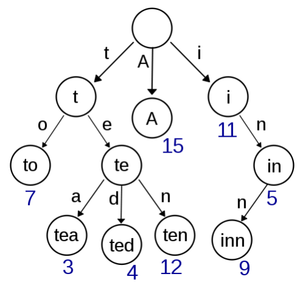

# 13.6 字典樹

字典樹（Trie）用於判斷字串是否存在或者是否具有某種字串前綴。

<figure>
  <span style={{ display: 'block', width: '50%', margin: '0 auto' }}>
    
  </span>
  <figcaption style={{ textAlign: 'center' }}>圖 13.1: 字典樹，儲存了單字 A、to、tea、ted、ten、i、in 和 inn，以及它們的頻率</figcaption>
</figure>

為什麼需要用字典樹解決這類問題呢？假如我們有一個儲存了近萬個單字的字典，即使我們使用雜湊表，在其中搜尋一個單字的實際開銷也是非常大的，且無法輕易支援搜尋單字前綴。然而由於一個英文單字的長度 n 通常在 10 以內，如果我們使用字典樹，則可以在 $O(n)$——近似 $O(1)$ 的時間內完成搜尋，且額外開銷非常小。

## [208. Implement Trie (Prefix Tree)](https://leetcode.com/problems/implement-trie-prefix-tree/)

### 題目描述

嘗試建立一個字典樹，支援快速插入單字、查找單字、查找單字前綴的功能。

### 輸入輸出範例

以下是資料結構的調用範例。

```
Trie trie = new Trie();
trie.insert("apple");
trie.search("apple"); // true
trie.search("app"); // false
trie.startsWith("app"); // true
trie.insert("app");
trie.search("app"); // true
```

### 題解

以下是字典樹的典型實現方法。

<Tabs>
<TabItem value="cpp" label="C++">

```cpp
struct TrieNode {
    bool word_ends;
    vector<TrieNode*> children;
    TrieNode() : word_ends(false), children(26, nullptr) {}
};

class Trie {
   public:
    Trie() : root_(new TrieNode()) {}

    void insert(string word) {
        TrieNode* node = root_;
        for (char c : word) {
            int pos = c - ’a’;
            if (node->children[pos] == nullptr) {
                node->children[pos] = new TrieNode();
            }
            node = node->children[pos];
        }
        node->word_ends = true;
    }

    bool search(string word) {
        TrieNode* node = root_;
        for (char c : word) {
            if (node == nullptr) {
                break;
            }
            node = node->children[c - ’a’];
        }
        return node != nullptr && node->word_ends;
    }

    bool startsWith(string prefix) {
        TrieNode* node = root_;
        for (char c : prefix) {
            if (node == nullptr) {
                break;
            }
            node = node->children[c - ’a’];
        }
        return node != nullptr;
    }

   private:
    TrieNode* root_;
};
```

</TabItem>
<TabItem value="py" label="Python">

```py
class TrieNode:
    def __init__(self):
        self.word_ends = False
        self.children = [None] * 26

class Trie:
    def __init__(self):
        self.root = TrieNode()

    def insert(self, word: str) -> None:
        node = self.root
        for c in word:
            pos = ord(c) - ord("a")
            if node.children[pos] is None:
                node.children[pos] = TrieNode()
            node = node.children[pos]
        node.word_ends = True

    def search(self, word: str) -> bool:
        node = self.root
        for c in word:
            if node is None:
                break
            node = node.children[ord(c) - ord("a")]
        return node is not None and node.word_ends

    def startsWith(self, prefix: str) -> bool:
        node = self.root
        for c in prefix:
            if node is None:
                break
            node = node.children[ord(c) - ord("a")]
        return node is not None

```

</TabItem>

</Tabs>