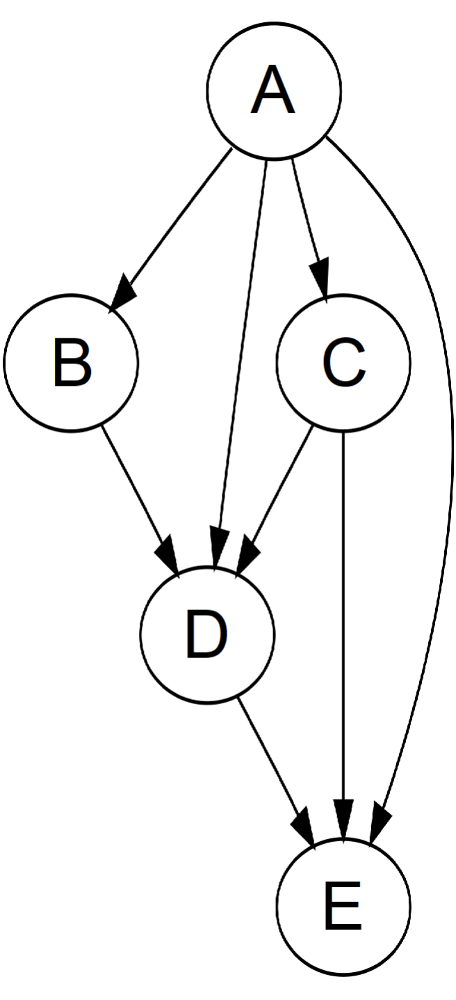

# 14.1 資料結構介紹

作為指標三劍客之一，圖是樹的升級版。`圖`通常可以分為有向（directed）或無向（undirected）、有循環（cyclic）或無循環（acyclic）、所有節點相連（connected）或不相連（disconnected）。樹其實就是一種相連的無向無環圖，而另一種很常見的圖則是`有向無環圖`（Directed Acyclic Graph，DAG）。

<figure>
  
    
  
  <figcaption style={{ textAlign: 'center' }}>圖 14.1: 有向無環圖範例</figcaption>
</figure>

圖通常有兩種表示方法。假設圖中有 `n` 個節點和 `m` 條邊。第一種表示方法是`鄰接矩陣`（adjacency matrix）：我們可以建立一個 `n × n` 的矩陣 `G`，如果第 `i` 個節點連向第 `j` 個節點，則 `G[i][j] = 1`，反之為 `0`；如果圖是無向的，則此矩陣必定是對稱矩陣，即 `G[i][j] = G[j][i]`。第二種表示方法是`鄰接鏈結串列`（adjacency list）：我們可以建立一個大小為 `n` 的陣列，每個位置 `i` 儲存一個陣列或鏈結串列，表示第 `i` 個節點連向的其他節點。鄰接矩陣的空間開銷比鄰接鏈結串列大，但鄰接鏈結串列不支援快速查找節點 `i` 和節點 `j` 是否相連。因此，可以根據題目的需要選擇適合的表示方法。此外，我們也可以直接用一個 `m × 2` 的矩陣來儲存所有的邊。
