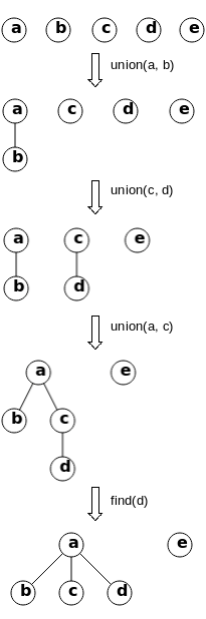

# 15.2 並查集

`並查集`（union-find, disjoint set）是一種用於動態連通性問題的數據結構，可以高效地實現動態連接兩個點，並快速判斷兩個點是否連通。假設有 n 個節點，我們初始化時將所有節點的父節點設為自身；每次需要連接節點 i 和 j 時，可以將秩較小一方的父節點標記為另一方（按秩合併）；每次需要查詢兩個節點是否相連時，可以查找 i 和 j 的祖先是否相同，並通過路徑壓縮減少祖先層級，從而加速後續的查詢操作。

<figure>
  <span style={{ display: 'block', width: '30%', margin: '0 auto' }}>
    
  </span>
  <figcaption style={{ textAlign: 'center' }}>圖 15.1: 並查集範例，其中 union 操作可以將兩個集合按秩合併，find 操作可以查找節點的祖先並壓縮路徑。</figcaption>
</figure>

## [684. Redundant Connection](https://leetcode.com/problems/redundant-connection/)

### 題目描述

在無向圖中找出一條邊，移除後該圖可以成為一棵樹（即無向無環圖）。如果有多個解，返回原陣列中位置最靠後的那條邊。

### 輸入輸出範例

輸入是一個二維陣列，表示所有的邊（對應的兩個節點）；輸出是一個一維陣列，表示需要移除的邊（對應的兩個節點）。

```
Input: [[1,2], [1,3], [2,3]]
  1
 / \
2 - 3
Output: [2,3]
```

### 題解

由於需要判斷是否兩個節點被重複連通，我們可以使用並查集來解決此類問題。以下為實現細節：

<Tabs>
<TabItem value="cpp" label="C++">

```cpp
class Solution {
   public:
    vector<int> findRedundantConnection(vector<vector<int>>& edges) {
        n_ = edges.size();
        id_ = vector<int>(n_);
        depth_ = vector<int>(n_, 1);
        for (int i = 0; i < n_; ++i) {
            id_[i] = i;
        }
        for (auto& edge : edges) {
            int i = edge[0], j = edge[1];
            if (linked(i - 1, j - 1)) {
                return vector<int>{i, j};
            }
            connect(i - 1, j - 1);
        }
        return vector<int>();
    }

   private:
    int find(int i) {
        // 路徑壓縮。
        while (i != id_[i]) {
            id_[i] = id_[id_[i]];
            i = id_[i];
        }
        return i;
    }

    void connect(int i, int j) {
        i = find(i), j = find(j);
        if (i == j) {
            return;
        }
        // 按秩合併。
        if (depth_[i] <= depth_[j]) {
            id_[i] = j;
            depth_[j] = max(depth_[j], depth_[i] + 1);
        } else {
            id_[j] = i;
            depth_[i] = max(depth_[i], depth_[j] + 1);
        }
    }

    bool linked(int i, int j) { return find(i) == find(j); }

    int n_;
    vector<int> id_;
    vector<int> depth_;
};
```

</TabItem>
<TabItem value="py" label="Python">

```py
class Solution:
    def __init__(self):
        self.n = 0
        self.id = None
        self.depth = None

    def find(self, i: int) -> int:
        # 路徑壓縮。
        while i != self.id[i]:
            self.id[i] = self.id[self.id[i]]
            i = self.id[i]
        return i

    def connect(self, i: int, j: int):
        i = self.find(i)
        j = self.find(j)
        if i == j:
            return
        # 按秩合併。
        if self.depth[i] <= self.depth[j]:
            self.id[i] = j
            self.depth[j] = max(self.depth[j], self.depth[i] + 1)
        else:
            self.id[j] = i
            self.depth[i] = max(self.depth[i], self.depth[j] + 1)

    def linked(self, i: int, j: int) -> bool:
        return self.find(i) == self.find(j)

    def findRedundantConnection(self, edges: List[List[int]]) -> List[int]:
        self.n = len(edges)
        self.id = list(range(self.n))
        self.depth = [1] * self.n
        for i, j in edges:
            if self.linked(i - 1, j - 1):
                return [i, j]
            self.connect(i - 1, j - 1)
        return []
```

</TabItem>

</Tabs>