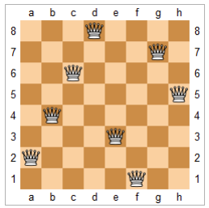

# 5.3 回溯法

`回溯法`（backtracking）是優先搜索的一種特殊情況，又稱為試探法，常用於需要記錄節點狀態的深度優先搜索。通常來說，排列、組合、選擇類問題使用回溯法比較方便。

顧名思義，回溯法的核心是回溯。在搜索到某一節點的時候，如果我們發現目前的節點（及其子節點）並不是需求目標時，我們回退到原來的節點繼續搜索，並且`把在目前節點修改的狀態還原`。這樣的好處是我們可以始終只對圖的總狀態進行修改，而非每次遍歷時新建一個圖來儲存狀態。在具體的寫法上，它與普通的深度優先搜索一樣，都有 [修改當前節點狀態]→[遞迴子節點] 的步驟，只是多了回溯的步驟，變成了 [修改當前節點狀態]→[遞迴子節點]→[回復當前節點狀態]。

沒有接觸過回溯法的讀者可能會不明白我在講什麼，這也完全正常，希望以下幾道題可以讓您理解回溯法。如果還是不明白，可以記住兩個小訣竅，`一是按引用傳遞狀態，二是所有的狀態修改在遞迴完成後回復`。

回溯法修改一般有兩種情況，一種是修改最後一位輸出，比如排列組合；一種是修改訪問標記，比如矩陣裡搜尋字串。


## [46. Permutations](https://leetcode.com/problems/permutations/)

### 題目描述

給定一個無重複數字的整數陣列，求其所有排列方式。

### 輸入輸出範例

輸入是一個一維整數陣列，輸出是一個二維陣列，表示輸入陣列的所有排列方式。

```
Input: [1,2,3]
Output: [[1,2,3], [1,3,2], [2,1,3], [2,3,1], [3,2,1], [3,1,2]]
```

輸出的順序無需固定，只需包含所有排列即可。

### 題解

如何生成所有排列方式呢？對於每個位置 \(i\)，我們可以將其與之後的任意位置交換，然後處理位置 \(i+1\)，直到處理到最後一位。為了避免每次遍歷時新建一個陣列儲存前 \(i\) 個已交換好的數字，我們可以利用回溯法，僅修改原陣列，並在遞迴完成後復原。

以樣例 `[1,2,3]` 為例，按照此方法，我們的輸出順序為：`[[1,2,3], [1,3,2], [2,1,3], [2,3,1], [3,2,1], [3,1,2]]`，確保涵蓋所有排列。


<Tabs>
<TabItem value="cpp" label="C++">

```cpp
// 輔助函式。
void backtracking(vector<int> &nums, int level,
                  vector<vector<int>> &permutations) {
    if (level == nums.size() - 1) {
        permutations.push_back(nums);  // 儲存當前排列。
        return;
    }
    for (int i = level; i < nums.size(); ++i) {
        swap(nums[i], nums[level]);  // 修改當前節點狀態。
        backtracking(nums, level + 1, permutations);  // 遞迴子節點。
        swap(nums[i], nums[level]);  // 回復當前節點狀態。
    }
}

// 主函式。
vector<vector<int>> permute(vector<int> &nums) {
    vector<vector<int>> permutations;
    backtracking(nums, 0, permutations);
    return permutations;
}
```

</TabItem>
<TabItem value="py" label="Python">

```py
# 輔助函式。
def backtracking(nums: List[int], level: int, permutations: List[List[int]]):
    if level == len(nums) - 1:
        permutations.append(nums[:])  # 使用淺拷貝保存當前排列。
        return
    for i in range(level, len(nums)):
        nums[i], nums[level] = nums[level], nums[i]  # 修改當前節點狀態。
        backtracking(nums, level + 1, permutations)  # 遞迴子節點。
        nums[i], nums[level] = nums[level], nums[i]  # 回復當前節點狀態。

# 主函式。
def permute(nums: List[int]) -> List[List[int]]:
    permutations = []
    backtracking(nums, 0, permutations)
    return permutations
```

</TabItem>

</Tabs>

## [77. Combinations](https://leetcode.com/problems/combinations/)

### 題目描述

給定一個整數 n 和一個整數 k，求在 1 到 n 中選取 k 個數字的所有組合方法。

### 輸入輸出範例

輸入是兩個正整數 n 和 k，輸出是一個二維陣列，表示所有組合方式。

```
Input: n = 4, k = 2
Output: [[2,4], [3,4], [2,3], [1,2], [1,3], [1,4]]
```

這裡二維陣列的每個維度都可以以任意順序輸出。

### 題解

類似於排列問題，我們也可以進行回溯。排列回溯的是交換的位置，而組合回溯的是是否把當前的數字加入結果中。

<Tabs>
<TabItem value="cpp" label="C++">

```cpp
// 輔助函式。
void backtracking(vector<vector<int>>& combinations, vector<int>& pick, int pos,
                  int n, int k) {
    if (pick.size() == k) {
        combinations.push_back(pick);
        return;
    }
    for (int i = pos; i <= n; ++i) {
        pick.push_back(i);  // 修改當前節點狀態
        backtracking(combinations, pick, i + 1, n, k);  // 遞迴子節點
        pick.pop_back();  // 回改當前節點狀態
    }
}

// 主函式。
vector<vector<int>> combine(int n, int k) {
    vector<vector<int>> combinations;
    vector<int> pick;
    backtracking(combinations, pick, 1, n, k);
    return combinations;
}
```

</TabItem>
<TabItem value="py" label="Python">

```py
# 輔助函式。
def backtracking(
    combinations: List[List[int]], pick: List[int], pos: int, n: int, k: int
):
    if len(pick) == k:
        combinations.append(pick[:]) # int為基本類型，可以淺拷貝
        return
    for i in range(pos, n + 1):
        pick.append(i) # 修改當前節點狀態
        backtracking(combinations, pick, i + 1, n, k) # 遞迴子節點
        pick.pop() # 回改當前節點狀態

# 主函式。
def combine(n: int, k: int) -> List[List[int]]:
    combinations = []
    pick = []
    backtracking(combinations, pick, 1, n, k)
    return combinations
```

</TabItem>

</Tabs>

## [79. Word Search](https://leetcode.com/problems/word-search/)

### 題目描述

給定一個字母矩陣，所有的字母都與上下左右四個方向上的字母相連。給定一個字串，求字串能不能在字母矩陣中尋找到。

### 輸入輸出範例

輸入是一個二維字元陣列和一個字串，輸出是一個布林值，表示字串是否可以被尋找到。

```
Input: word = "ABCCED", board =
[[’A’,’B’,’C’,’E’],
 [’S’,’F’,’C’,’S’],
 [’A’,’D’,’E’,’E’]]
Output: true
```

從左上角的 ‘A’ 開始，我們可以先向右、再向下、最後向左，找到連續的 "ABCCED"。

### 題解

不同於排列組合問題，本題採用的並不是修改輸出方式，而是修改訪問標記。在我們對任意位置進行深度優先搜尋時，我們先標記當前位置為已訪問，以避免重複遍歷（如防止向右搜尋後又向左返回）；在所有的可能都搜尋完成後，再回改當前位置為未訪問，防止干擾其他位置搜尋到當前位置。使用回溯法時，我們可以只對一個二維的訪問矩陣進行修改，而不用把每次的搜尋狀態作為一個新對象傳入遞迴函式中。


<Tabs>
<TabItem value="cpp" label="C++">

```cpp
// 輔助函式。
bool backtracking(vector<vector<char>>& board, string& word,
                  vector<vector<bool>>& visited, int i, int j, int word_pos) {
    if (i < 0 || i >= board.size() || j < 0 || j >= board[0].size() ||
        visited[i][j] || board[i][j] != word[word_pos]) {
        return false;
    }
    if (word_pos == word.size() - 1) {
        return true;
    }
    visited[i][j] = true;  // 修改當前節點狀態
    if (backtracking(board, word, visited, i + 1, j, word_pos + 1) ||
        backtracking(board, word, visited, i - 1, j, word_pos + 1) ||
        backtracking(board, word, visited, i, j + 1, word_pos + 1) ||
        backtracking(board, word, visited, i, j - 1, word_pos + 1)) {
        return true;  // 遞迴子節點
    }
    visited[i][j] = false;  // 回改當前節點狀態
    return false;
}

// 主函式。
bool exist(vector<vector<char>>& board, string word) {
    int m = board.size(), n = board[0].size();
    vector<vector<bool>> visited(m, vector<bool>(n, false));
    for (int i = 0; i < m; ++i) {
        for (int j = 0; j < n; ++j) {
            if (backtracking(board, word, visited, i, j, 0)) {
                return true;
            }
        }
    }
    return false;
}
```

</TabItem>
<TabItem value="py" label="Python">

```py
# 輔助函式。
def backtracking(board: List[List[str]], word: str,
                visited: List[List[bool]], i: int, j: int, word_pos: int):
    if (i < 0 or i >= len(board) or j < 0 or j >= len(board[0])
        or visited[i][j] or board[i][j] != word[word_pos]):
        return False
    if word_pos == len(word) - 1:
        return True
    visited[i][j] = True # 修改當前節點狀態
    if (backtracking(board, word, visited, i + 1, j, word_pos + 1) or
        backtracking(board, word, visited, i - 1, j, word_pos + 1) or
        backtracking(board, word, visited, i, j + 1, word_pos + 1) or
        backtracking(board, word, visited, i, j - 1, word_pos + 1)):
        return True # 遞迴子節點
    visited[i][j] = False # 回改當前節點狀態
    return False

# 主函式。
def exist(board: List[List[str]], word: str) -> bool:
    m, n = len(board), len(board[0])
    visited = [[False for _ in range(n)] for _ in range(m)]
    return any([
        backtracking(board, word, visited, i, j, 0)
        for i in range(m) for j in range(n)
     ])
```

</TabItem>

</Tabs>

## [51. N-Queens](https://leetcode.com/problems/n-queens/)

### 題目描述

給定一個大小為 n 的正方形國際象棋棋盤，求有多少種方式可以放置 n 個皇后並使得她們互不攻擊，即每一行、列、左斜、右斜最多只有一個皇后。

<figure>

<figcaption>題目 51 - 八皇后的一種解法</figcaption>
</figure>

### 輸入輸出範例

輸入是一個整數 n，輸出是一個二維字串陣列，表示所有的棋盤表示方法。

```
Input: 4
Output: [
 [".Q..", // Solution 1
  "...Q",
  "Q...",
  "..Q."],
 ["..Q.", // Solution 2
  "Q...",
  "...Q",
  ".Q.."]
]
```

在這個範例中，點代表空白位置，Q 代表皇后。

### 題解

類似於在矩陣中尋找字串，本題也是透過修改狀態矩陣來進行回溯。不過不同的是，我們需要對每一行、列、左斜、右斜建立訪問陣列，用來記錄這些方向是否已經放置過皇后。如果我們按照每一行遍歷來插入皇后，就不需要為行方向建立訪問陣列。

<Tabs>
<TabItem value="cpp" label="C++">

```cpp
// 輔助函式
void backtracking(vector<vector<string>> &solutions, vector<string> &board,
                  vector<bool> &column, vector<bool> &ldiag,
                  vector<bool> &rdiag, int row) {
    int n = board.size();
    if (row == n) {
        solutions.push_back(board);
        return;
    }
    for (int i = 0; i < n; ++i) {
        if (column[i] || ldiag[n - row + i - 1] || rdiag[row + i]) {
            continue;
        }
        // 修改當前節點狀態
        board[row][i] = 'Q';
        column[i] = ldiag[n - row + i - 1] = rdiag[row + i] = true;
        // 遞迴子節點
        backtracking(solutions, board, column, ldiag, rdiag, row + 1);
        // 回改當前節點狀態
        board[row][i] = '.';
        column[i] = ldiag[n - row + i - 1] = rdiag[row + i] = false;
    }
}

// 主函式。
vector<vector<string>> solveNQueens(int n) {
    vector<vector<string>> solutions;
    vector<string> board(n, string(n, ’.’));
    vector<bool> column(n, false);
    vector<bool> ldiag(2 * n - 1, false);
    vector<bool> rdiag(2 * n - 1, false);
    backtracking(solutions, board, column, ldiag, rdiag, 0);
    return solutions;
}
```

</TabItem>
<TabItem value="py" label="Python">

```py
# 輔助函式。
def backtracking(solutions: List[List[str]], board: List[List[str]],
    column: List[bool], ldiag: List[bool], rdiag: List[bool], row: int):
    n = len(board)
    if row == n:
        solutions.append(["".join(row) for row in board])
        return
    for i in range(n):
        if column[i] or ldiag[n - row + i - 1] or rdiag[row + i]:
            continue
        # 修改當前節點狀態
        board[row][i] = "Q"
        column[i] = ldiag[n - row + i - 1] = rdiag[row + i] = True
        # 遞迴子節點
        backtracking(solutions, board, column, ldiag, rdiag, row + 1)
        # 回改當前節點狀態
        board[row][i] = "."
        column[i] = ldiag[n - row + i - 1] = rdiag[row + i] = False

# 主函式。
def solveNQueens(n: int) -> List[List[str]]:
    solutions = []
    board = [["." for _ in range(n)] for _ in range(n)]
    column = [False] * n
    ldiag = [False] * (2 * n - 1)
    rdiag = [False] * (2 * n - 1)
    backtracking(solutions, board, column, ldiag, rdiag, 0)
    return solutions
```

</TabItem>

</Tabs>