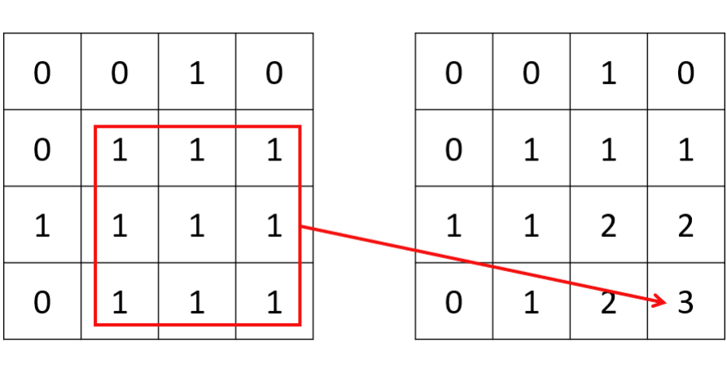

# 6.3 基本動態規劃：二維

## [64. Minimum Path Sum](https://leetcode.com/problems/minimum-path-sum/)

### 題目描述

給定一個 $m × n$ 大小的非負整數矩陣，求從左上角開始到右下角結束的、經過的數字的和最小的路徑。每次只能向右或者向下移動。

### 輸入輸出範例

輸入是二維數組，輸出是最優路徑的數字和。

```
Input:
[[1,3,1],
 [1,5,1],
 [4,2,1]]
Output: 7
```

在這個範例中，最短路徑為 1->3->1->1->1。

### 題解

我們可以定義一個同樣是二維的 `dp` 陣列，其中 `dp[i][j]` 表示從左上角開始到 `(i, j)` 位置的最優路徑的數字和。因為每次只能向下或者向右移動，我們可以很直觀地得到狀態轉移方程 `dp[i][j] = grid[i][j] + min(dp[i-1][j], dp[i][j-1])`，其中 `grid` 表示原數組。

:::warning

在 Python 中，多維數組的初始化比較特殊，直接初始化為 `[[val] * n] * m` 會導致只是創造了 `m` 個 `[[val] * n]` 的引用。正確的初始化方法為 `[[val for _ in range(n)] for _ in range(m)]`。

:::

<Tabs>
<TabItem value="cpp" label="C++">

```cpp
int minPathSum(vector<vector<int>>& grid) {
    int m = grid.size(), n = grid[0].size();
    vector<vector<int>> dp(m, vector<int>(n, 0));
    for (int i = 0; i < m; ++i) {
        for (int j = 0; j < n; ++j) {
            if (i == 0 && j == 0) {
                dp[i][j] = grid[i][j];
            } else if (i == 0) {
                dp[i][j] = grid[i][j] + dp[i][j - 1];
            } else if (j == 0) {
                dp[i][j] = grid[i][j] + dp[i - 1][j];
            } else {
                dp[i][j] = grid[i][j] + min(dp[i - 1][j], dp[i][j - 1]);
            }
        }
    }
    return dp[m - 1][n - 1];
}
```

</TabItem>
<TabItem value="py" label="Python">

```py
def minPathSum(grid: List[List[int]]) -> int:
    m, n = len(grid), len(grid[0])
    dp = [[0 for _ in range(n)] for _ in range(m)]
    for i in range(m):
        for j in range(n):
            if i == j == 0:
                dp[i][j] = grid[i][j]
            elif i == 0:
                dp[i][j] = grid[i][j] + dp[i][j - 1]
            elif j == 0:
                dp[i][j] = grid[i][j] + dp[i - 1][j]
            else:
                dp[i][j] = grid[i][j] + min(dp[i][j - 1], dp[i - 1][j])
    return dp[m - 1][n - 1]
```

</TabItem>

</Tabs>

因為 dp 矩陣的每一個值只和左邊和上面的值相關，我們可以使用空間壓縮將 dp 陣列壓縮為一維。對於第 i 行，在遍歷到第 j 列的時候，因為第 j-1 列已經更新過了，所以 dp[j-1] 代表 dp[i][j-1] 的值；而 dp[j] 待更新，當前儲存的值是在第 i-1 行的時候計算的，所以代表 dp[i-1][j] 的值。

:::warning

如果不是很熟悉空間壓縮技巧，建議您優先嘗試寫出非空間壓縮的解法，若時間充裕且能力允許再進行空間壓縮。

:::

<Tabs>
<TabItem value="cpp" label="C++">

```cpp
int minPathSum(vector<vector<int>>& grid) {
    int m = grid.size(), n = grid[0].size();
    vector<int> dp(n, 0);
    for (int i = 0; i < m; ++i) {
        for (int j = 0; j < n; ++j) {
            if (i == 0 && j == 0) {
                dp[j] = grid[i][j];
            } else if (i == 0) {
                dp[j] = grid[i][j] + dp[j - 1];
            } else if (j == 0) {
                dp[j] = grid[i][j] + dp[j];
            } else {
                dp[j] = grid[i][j] + min(dp[j], dp[j - 1]);
            }
        }
    }
    return dp[n - 1];
}
```

</TabItem>
<TabItem value="py" label="Python">

```py
def minPathSum(grid: List[List[int]]) -> int:
    m, n = len(grid), len(grid[0])
    dp = [0 for _ in range(n)]
    for i in range(m):
        for j in range(n):
        if i == j == 0:
            dp[j] = grid[i][j]
        elif i == 0:
            dp[j] = grid[i][j] + dp[j - 1]
        elif j == 0:
            dp[j] = grid[i][j] + dp[j]
        else:
            dp[j] = grid[i][j] + min(dp[j - 1], dp[j])
    return dp[n - 1]
```

</TabItem>

</Tabs>


## [542. 01 Matrix](https://leetcode.com/problems/01-matrix/)

### 題目描述

給定一個由 0 和 1 組成的二維矩陣，求每個位置到最近的 0 的距離。

### 輸入輸出範例

輸入是一個二維 0-1 陣列，輸出是一個同樣大小的非負整數陣列，表示每個位置到最近的 0 的距離。

```
Input:
[[0,0,0],
 [0,1,0],
 [1,1,1]]

Output:
[[0,0,0],
 [0,1,0],
 [1,2,1]]
```

### 題解

一般來說，因為這道題涉及到四個方向上的最近搜尋，所以很多人的第一反應可能會是廣度優先搜尋。但是對於一個大小 $O(mn)$ 的二維陣列，對每個位置進行四向搜尋，最壞情況的時間複雜度（即全是 1）會達到驚人的 $O(m^2n^2)$。

一種方法是使用一個二維布林值陣列進行記憶化，使得廣度優先搜尋不會重複遍歷相同位置；另一種更簡單的方法是，我們從左上到右下進行一次動態搜尋，再從右下到左上進行一次動態搜尋。兩次動態搜尋即可完成四個方向上的查找。


<Tabs>
<TabItem value="cpp" label="C++">

```cpp
vector<vector<int>> updateMatrix(vector<vector<int>>& matrix) {
    int m = matrix.size(), n = matrix[0].size();
    vector<vector<int>> dp(m, vector<int>(n, numeric_limits<int>::max() - 1));
    for (int i = 0; i < m; ++i) {
        for (int j = 0; j < n; ++j) {
            if (matrix[i][j] != 0) {
                if (i > 0) {
                    dp[i][j] = min(dp[i][j], dp[i - 1][j] + 1);
                }
                if (j > 0) {
                    dp[i][j] = min(dp[i][j], dp[i][j - 1] + 1);
                }
            } else {
                dp[i][j] = 0;
            }
        }
    }
    for (int i = m - 1; i >= 0; --i) {
        for (int j = n - 1; j >= 0; --j) {
            if (matrix[i][j] != 0) {
                if (i < m - 1) {
                    dp[i][j] = min(dp[i][j], dp[i + 1][j] + 1);
                }
                if (j < n - 1) {
                    dp[i][j] = min(dp[i][j], dp[i][j + 1] + 1);
                }
            }
        }
    }
    return dp;
}
```

</TabItem>
<TabItem value="py" label="Python">

```py
def updateMatrix(matrix: List[List[int]]) -> List[List[int]]:
    m, n = len(matrix), len(matrix[0])
    dp = [[sys.maxsize - 1 for _ in range(n)] for _ in range(m)]
    for i in range(m):
        for j in range(n):
            if matrix[i][j] != 0:
                if i > 0:
                    dp[i][j] = min(dp[i][j], dp[i - 1][j] + 1)
                if j > 0:
                    dp[i][j] = min(dp[i][j], dp[i][j - 1] + 1)
            else:
                dp[i][j] = 0
    for i in range(m - 1, -1, -1): # m-1 to 0, reversed
        for j in range(n - 1, -1, -1): # n-1 to 0, reversed
            if matrix[i][j] != 0:
                if i < m - 1:
                    dp[i][j] = min(dp[i][j], dp[i + 1][j] + 1)
                if j < n - 1:
                    dp[i][j] = min(dp[i][j], dp[i][j + 1] + 1)
        return dp
```

</TabItem>

</Tabs>

## [221. Maximal Square](https://leetcode.com/problems/maximal-square/)

### 題目描述

給定一個二維的 0-1 矩陣，求全由 1 構成的最大正方形面積。

### 輸入輸出範例

輸入是一個二維 0-1 陣列，輸出是最大正方形面積。

```
Input:
[["1","0","1","0","0"],
 ["1","0","1","1","1"],
 ["1","1","1","1","1"],
 ["1","0","0","1","0"]]
Output: 4
```

### 題解

對於在矩陣內搜尋正方形或長方形的題型，一種常見的做法是定義一個二維 dp 陣列，其中 dp[i][j] 表示滿足題目條件的、以 (i, j) 為右下角的正方形或者長方形的屬性。對於本題，則表示以 (i, j) 為右下角的全由 1 構成的最大正方形邊長。如果當前位置是 0，那麼 dp[i][j] 即為 0；如果當前位置是 1，我們假設 dp[i][j] = k，其充分條件為 dp[i-1][j-1]、dp[i][j-1] 和 dp[i-1][j] 的值必須都不小於 k − 1，否則 (i, j) 位置不可以構成一個面積為 $k^2$ 的正方形。同理，如果這三個值中的最小值為 k − 1，則 (i, j) 位置一定且最大可以構成一個面積為 $k^2$ 的正方形。


<figure>
  <span style={{ display: 'block', width: '75%', margin: '0 auto' }}>
    
  </span>
  <figcaption style={{ textAlign: 'center' }}>圖 6.1: 題目 221 - 左邊為一個 0-1 矩陣，右邊為其對應的 dp 矩陣，我們可以發現最大的正方形邊長為 3</figcaption>
</figure>

<Tabs>
<TabItem value="cpp" label="C++">

```cpp
int maximalSquare(vector<vector<char>>& matrix) {
    int m = matrix.size(), n = matrix[0].size();
    int max_side = 0;
    vector<vector<int>> dp(m + 1, vector<int>(n + 1, 0));
    for (int i = 1; i <= m; ++i) {
        for (int j = 1; j <= n; ++j) {
            if (matrix[i - 1][j - 1] == ’1’) {
                dp[i][j] =
                    min(dp[i - 1][j - 1], min(dp[i][j - 1], dp[i - 1][j])) + 1;
            }
            max_side = max(max_side, dp[i][j]);
        }
    }
    return max_side * max_side;
}
```

</TabItem>
<TabItem value="py" label="Python">

```py
def maximalSquare(matrix: List[List[str]]) -> int:
    m, n = len(matrix), len(matrix[0])
    dp = [[0 for _ in range(n + 1)] for _ in range(m + 1)]
    for i in range(1, m + 1):
        for j in range(1, n + 1):
            if matrix[i - 1][j - 1] == "1":
                dp[i][j] = min(dp[i - 1][j - 1], dp[i][j - 1], dp[i - 1][j]) + 1
    return max(max(row) for row in dp) ** 2
```

</TabItem>

</Tabs>