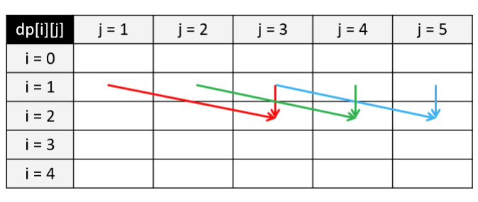

# 6.6 背包問題

`背包問題（knapsack problem）` 是一種組合優化的 NP 完全問題：有 n 個物品和載重為 w 的背包，每個物品都有自己的重量 weight 和價值 value，求拿哪些物品可以使得背包所裝下物品的總價值最大。如果限定每種物品只能選擇 0 個或 1 個，則問題稱為 `0-1 背包問題（0-1 knapsack）`；如果不限定每種物品的數量，則問題稱為 `無界背包問題或完全背包問題（unbounded knapsack）`。

我們可以用動態規劃來解決背包問題。以 0-1 背包問題為例。我們可以定義一個二維陣列 dp 儲存最大價值，其中 dp[i][j] 表示前 i 件物品重量不超過 j 的情況下能達到的最大價值。在我們遍歷到第 i 件物品時，在當前背包總載重為 j 的情況下，如果我們不將物品 i 放入背包，那麼 dp[i][j] = dp[i-1][j]，即前 i 個物品的最大價值等於只取前 i-1 個物品時的最大價值；如果我們將物品 i 放入背包，假設第 i 件物品重量為 weight，價值為 value，那麼我們得到 dp[i][j] = dp[i-1][j-weight] + value。我們只需在遍歷過程中對這兩種情況取最大值即可，總時間複雜度和空間複雜度都為 $O(nw)$。


<Tabs>
<TabItem value="cpp" label="C++">

```cpp
int knapsack(vector<int> weights, vector<int> values, int n, int w) {
    vector<vector<int>> dp(n + 1, vector<int>(w + 1, 0));
    for (int i = 1; i <= n; ++i) {
        int weight = weights[i - 1], value = values[i - 1];
        for (int j = 1; j <= w; ++j) {
            if (j >= weight) {
                dp[i][j] = max(dp[i - 1][j], dp[i - 1][j - weight] + value);
            } else {
                dp[i][j] = dp[i - 1][j];
            }
        }
    }
    return dp[n][w];
}
```

</TabItem>
<TabItem value="py" label="Python">

```py
def knapsack(weights: List[int], values: List[int], n: int, w: int) -> int:
    dp = [[0 for _ in range(w + 1)] for _ in range(n + 1)]
    for i in range(1, n + 1):
        weight, value = weights[i - 1], values[i - 1]
        for j in range(1, w + 1):
            if j >= weight:
                dp[i][j] = max(dp[i - 1][j], dp[i - 1][j - weight] + value)
            else:
                dp[i][j] = dp[i - 1][j]
    return dp[n][w]
```

</TabItem>

</Tabs>

<figure>
  <span style={{ display: 'block', width: '75%', margin: '0 auto' }}>
    
  </span>
  <figcaption style={{ textAlign: 'center' }}>圖 6.3: 0-1 背包問題 - 狀態轉移矩陣範例</figcaption>
</figure>

我們可以進一步對 0-1 背包進行空間優化，將空間複雜度降低為 $O(w)$。如圖所示，假設我們目前考慮物品 $i = 2$，且其重量為 $weight = 2$，價值為 $value = 3$；對於背包載重 $j$，我們可以得到 $dp[2][j] = max(dp[1][j], dp[1][j-2] + 3)$。這裡可以發現我們永遠只依賴於上一排 $i = 1$ 的資訊，之前算過的其他物品都不需要再使用。因此我們可以去掉 $dp$ 矩陣的第一個維度，在考慮物品 $i$ 時變成 $dp[j] = max(dp[j], dp[j-weight] + value)$。這裡要注意我們在遍歷每一行的時候必須 **逆向遍歷**，這樣才能夠調用上一行物品 $i-1$ 時 $dp[j-weight]$ 的值；若按照從左往右的順序進行正向遍歷，則 $dp[j-weight]$ 的值在遍歷到 $j$ 之前就已經被更新成物品 $i$ 的值了。


<Tabs>
<TabItem value="cpp" label="C++">

```cpp
int knapsack(vector<int> weights, vector<int> values, int n, int w) {
    vector<int> dp(w + 1, 0);
    for (int i = 1; i <= n; ++i) {
        int weight = weights[i - 1], value = values[i - 1];
        for (int j = w; j >= weight; --j) {
            dp[j] = max(dp[j], dp[j - weight] + value);
        }
    }
    return dp[w];
}
```

</TabItem>
<TabItem value="py" label="Python">

```py
def knapsack(weights: List[int], values: List[int], n: int, w: int) -> int:
    dp = [0] * (w + 1)
    for i in range(1, n + 1):
        weight, value = weights[i - 1], values[i - 1]
        for j in range(w, weight - 1, -1):
            dp[j] = max(dp[j], [j - weight] + value)
    return dp[w]
```

</TabItem>

</Tabs>

在完全背包問題中，一個物品可以拿多次。如圖上半部分所示，假設我們遍歷到物品 $i = 2$，且其重量為 $weight = 2$，價值為 $value = 3$；對於背包載重 $j = 5$，最多只能裝下 2 個該物品。那麼我們的狀態轉移方程就變成了 $dp[2][5] = max(dp[1][5], dp[1][3] + 3, dp[1][1] + 6)$。如果採用這種方法，假設背包載重無窮大而物品的重量無窮小，我們這裡的比較次數也會趨近於無窮大，遠超 $O(nw)$ 的時間複雜度。

<figure>
  <span style={{ display: 'block', width: '75%', margin: '0 auto' }}>
    
  </span>
  <figcaption style={{ textAlign: 'center' }}>圖 6.4: 完全背包問題 - 狀態轉移矩陣範例</figcaption>
</figure>

怎麼解決這個問題呢？我們發現在 $dp[2][3]$ 的時候我們其實已經考慮了 $dp[1][3]$ 和 $dp[2][1]$ 的情況，而在 $dp[2][1]$ 時也已經考慮了 $dp[1][1]$ 的情況。因此，如圖下半部分所示，對於拿多個物品的情況，我們只需考慮 $dp[2][3]$ 即可，即 $dp[2][5] = max(dp[1][5], dp[2][3] + 3)$。這樣，我們就得到了完全背包問題的狀態轉移方程：$dp[i][j] = max(dp[i-1][j], dp[i][j-w] + v)$，其與 0-1 背包問題的差別僅僅是把狀態轉移方程中的第二個 $i-1$ 變成了 $i$。


<Tabs>
<TabItem value="cpp" label="C++">

```cpp
int knapsack(vector<int> weights, vector<int> values, int n, int w) {
    vector<vector<int>> dp(n + 1, vector<int>(w + 1, 0));
    for (int i = 1; i <= n; ++i) {
        int weight = weights[i - 1], value = values[i - 1];
        for (int j = 1; j <= w; ++j) {
            if (j >= weight) {
                dp[i][j] = max(dp[i - 1][j], dp[i][j - weight] + value);
            } else {
                dp[i][j] = dp[i - 1][j];
            }
        }
    }
    return dp[n][w];
}
```

</TabItem>
<TabItem value="py" label="Python">

```py
def knapsack(weights: List[int], values: List[int], n: int, w: int) -> int:
    dp = [[0 for _ in range(w + 1)] for _ in range(n + 1)]
    for i in range(1, n + 1):
        weight, value = weights[i - 1], values[i - 1]
        for j in range(1, w + 1):
            if j >= weight:
                dp[i][j] = max(dp[i - 1][j], dp[i][j - weight] + value)
            else:
                dp[i][j] = dp[i - 1][j]
    return dp[n][w]
```

</TabItem>

</Tabs>

同樣的，我們也可以利用空間壓縮將時間複雜度降低為 $O(w)$。這裡要注意我們在遍歷每一行的時候必須`正向遍歷`，因為我們需要利用當前物品在第 $j-weight$ 列的信息。

<Tabs>
<TabItem value="cpp" label="C++">

```cpp
int knapsack(vector<int> weights, vector<int> values, int n, int w) {
    vector<int> dp(w + 1, 0);
    for (int i = 1; i <= n; ++i) {
        int weight = weights[i - 1], value = values[i - 1];
        for (int j = weight; j <= w; ++j) {
            dp[j] = max(dp[j], dp[j - weight] + value);
        }
    }
    return dp[w];
}
```

</TabItem>
<TabItem value="py" label="Python">

```py
def knapsack(weights: List[int], values: List[int], n: int, w: int) -> int:
    dp = [0] * (w + 1)
    for i in range(1, n + 1):
        weight, value = weights[i - 1], values[i - 1]
        for j in range(weight, w + 1):
            dp[j] = max(dp[j], [j - weight] + value)
    return dp[w]
```

</TabItem>

</Tabs>

:::warning

壓縮空間時到底需要`正向`還是`逆向`遍歷呢？物品和重量哪個放在外層，哪個放在內層呢？這取決於狀態轉移方程的依賴關係。在思考空間壓縮前，不妨將狀態轉移矩陣畫出來，方便思考如何進行空間壓縮，以及壓縮哪個維度更省空間。

:::

## [416. Partition Equal Subset Sum](https://leetcode.com/problems/partition-equal-subset-sum/)

### 題目描述

給定一個正整數陣列，求是否可以把這個陣列分成和相等的兩部分。

### 輸入輸出範例

輸入是一個一維正整數陣列，輸出是一個布林值，表示是否可以滿足題目要求。

```
Input: [1,5,11,5]
Output: true
```

在這個範例中，滿足條件的分割方法是 [1,5,5] 和 [11]。

### 題解

本題等價於 0-1 背包問題，設所有數字和為 sum，我們的目標是選取一部分物品，使得它們的總和為 sum/2。這道題不需要考慮價值，因此我們只需要通過一個布林值矩陣來表示狀態轉移矩陣。注意邊界條件的處理。

<Tabs>
<TabItem value="cpp" label="C++">

```cpp
bool canPartition(vector<int> &nums) {
    int nums_sum = accumulate(nums.begin(), nums.end(), 0);
    if (nums_sum % 2 != 0) {
        return false;
    }
    int target = nums_sum / 2, n = nums.size();
    vector<vector<bool>> dp(n + 1, vector<bool>(target + 1, false));
    dp[0][0] = true;
    for (int i = 1; i <= n; ++i) {
        for (int j = 0; j <= target; ++j) {
            if (j < nums[i - 1]) {
                dp[i][j] = dp[i - 1][j];
            } else {
                dp[i][j] = dp[i - 1][j] || dp[i - 1][j - nums[i - 1]];
            }
        }
    }
    return dp[n][target];
}
```

</TabItem>
<TabItem value="py" label="Python">

```py
def canPartition(nums: List[int]) -> bool:
    nums_sum = sum(nums)
    if nums_sum % 2 != 0:
        return False
    target, n = nums_sum // 2, len(nums)
    dp = [[False for _ in range(target + 1)] for _ in range(n + 1)]
    dp[0][0] = True
    for i in range(1, n + 1):
        for j in range(target + 1):
            if j < nums[i - 1]:
                dp[i][j] = dp[i - 1][j]
            else:
                dp[i][j] = dp[i - 1][j] or dp[i - 1][j - nums[i - 1]]
    return dp[n][target]
```

</TabItem>

</Tabs>

同樣的，我們也可以對本題進行空間壓縮。注意對數字和的遍歷需要逆向。

<Tabs>
<TabItem value="cpp" label="C++">

```cpp
bool canPartition(vector<int> &nums) {
    int nums_sum = accumulate(nums.begin(), nums.end(), 0);
    if (nums_sum % 2 != 0) {
        return false;
    }
    int target = nums_sum / 2, n = nums.size();
    vector<bool> dp(target + 1, false);
    dp[0] = true;
    for (int i = 1; i <= n; ++i) {
        for (int j = target; j >= nums[i - 1]; --j) {
            dp[j] = dp[j] || dp[j - nums[i - 1]];
        }
    }
    return dp[target];
}
```

</TabItem>
<TabItem value="py" label="Python">

```py
def canPartition(nums: List[int]) -> bool:
    nums_sum = sum(nums)
    if nums_sum % 2 != 0:
        return False
    target, n = nums_sum // 2, len(nums)
    dp = [True] + [False] * target
    for i in range(1, n + 1):
        for j in range(target, nums[i - 1] - 1, -1):
            dp[j] = dp[j] or dp[j - nums[i - 1]]
    return dp[target]
```

</TabItem>

</Tabs>

## [474. Ones and Zeroes](https://leetcode.com/problems/ones-and-zeroes/)

### 題目描述

給定 $m$ 個數字 0 和 $n$ 個數字 1，以及一些由 0-1 構成的字串，求利用這些數字最多可以構成多少個給定的字串，字串只可以構成一次。

### 輸入輸出範例

輸入兩個整數 $m$ 和 $n$，表示 0 和 1 的數量，以及一維字串陣列，表示待構成的字串；
輸出是一個整數，表示最多可以生成的字串個數。

```
Input: Array = {"10", "0001", "111001", "1", "0"}, m = 5, n = 3
Output: 4
```

在這個範例中，我們可以用 5 個 0 和 3 個 1 構成 [“10”, “0001”, “1”, “0”]。

### 題解

這是一個多維費用的 0-1 背包問題，有兩個背包大小，分別是 0 的數量和 1 的數量。以下直接展示將三維空間壓縮到二維後的寫法。

<Tabs>
<TabItem value="cpp" label="C++">

```cpp
int findMaxForm(vector<string>& strs, int m, int n) {
    vector<vector<int>> dp(m + 1, vector<int>(n + 1, 0));
    for (const string& s : strs) {
        int zeros = 0, ones = 0;
        for (char c : s) {
            if (c == ’0’) {
                ++zeros;
            } else {
                ++ones;
            }
        }
        for (int i = m; i >= zeros; --i) {
            for (int j = n; j >= ones; --j) {
                dp[i][j] = max(dp[i][j], dp[i - zeros][j - ones] + 1);
            }
        }
    }
    return dp[m][n];
}
```

</TabItem>
<TabItem value="py" label="Python">

```py
def findMaxForm(strs: List[str], m: int, n: int) -> int:
    dp = [[0 for _ in range(n + 1)] for _ in range(m + 1)]
    for s in strs:
        zeros = len(list(filter(lambda c: c == "0", s)))
        ones = len(s) - zeros
        for i in range(m, zeros - 1, -1):
            for j in range(n, ones - 1, -1):
                dp[i][j] = max(dp[i][j], dp[i - zeros][j - ones] + 1)
    return dp[m][n]
```

</TabItem>

</Tabs>

## [322. Coin Change](https://leetcode.com/problems/coin-change/)

### 題目描述

給定一些硬幣的面額，求最少可以用多少顆硬幣組成給定的金額。

### 輸入輸出範例

輸入一個一維整數陣列，表示硬幣的面額；以及一個整數，表示給定的金額。輸出一個整數，表示滿足條件的最少的硬幣數量。若不存在解，則返回 -1。

```
Input: coins = [1, 2, 5], amount = 11
Output: 3
```

在這個範例中，最少的組合方法是 11 = 5 + 5 + 1。

### 題解

因為每個硬幣可以用無限多次，這道題本質上是完全背包。我們直接展示二維空間壓縮為一維的寫法。

這裡注意，我們把 `dp` 陣列初始化為 `amount + 1` 而不是 `-1` 的原因是，在動態規劃過程中有求最小值的操作，如果初始化成 `-1` 則會導致結果始終為 `-1`。至於為什麼取這個值，是因為 `i` 最大可以取 `amount`，而最多的組成方式是只用 1 元硬幣，因此 `amount + 1` 一定大於所有可能的組合方式，取最小值時一定不會是它。在動態規劃完成後，若結果仍然是此值，則說明不存在滿足條件的組合方法，返回 `-1`。

<Tabs>
<TabItem value="cpp" label="C++">

```cpp
int coinChange(vector<int>& coins, int amount) {
    vector<int> dp(amount + 1, amount + 1);
    dp[0] = 0;
    for (int i = 1; i <= amount; ++i) {
        for (int coin : coins) {
            if (i >= coin) {
                dp[i] = min(dp[i], dp[i - coin] + 1);
            }
        }
    }
    return dp[amount] != amount + 1 ? dp[amount] : -1;
}
```

</TabItem>
<TabItem value="py" label="Python">

```py
def coinChange(coins: List[int], amount: int) -> int:
    dp = [0] + [amount + 1] * amount
    for i in range(1, amount + 1):
        for coin in coins:
            if i >= coin:
                dp[i] = min(dp[i], dp[i - coin] + 1)
    return dp[amount] if dp[amount] != amount + 1 else -1
```

</TabItem>

</Tabs>