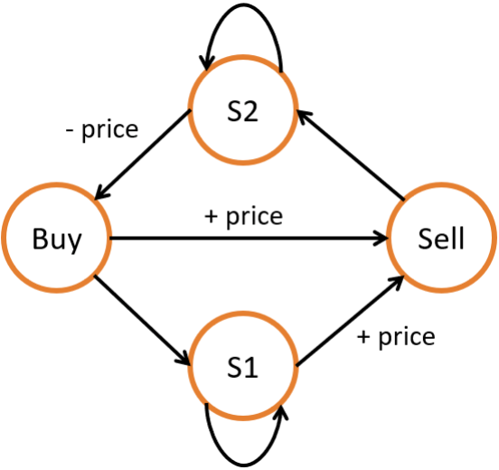

# 6.8 股票交易

`股票交易`類問題通常可以用動態規劃來解決。對於稍微複雜一些的股票交易類問題，比如需要冷卻時間或者交易費用，則可以通過動態規劃實現的`狀態機`來解決。

## [121. Best Time to Buy and Sell Stock](https://leetcode.com/problems/best-time-to-buy-and-sell-stock/)

### 題目描述

給定一段時間內每天某只股票的固定價格，已知你只可以買賣各一次，求最大的收益。

### 輸入輸出範例

輸入一個一維整數陣列，表示每天的股票價格；輸出一個整數，表示最大的收益。

```
Input: [7,1,5,3,6,4]
Output: 5
```

在這個範例中，最大的利潤為在第二天價格為 1 時買入，在第五天價格為 6 時賣出。

### 題解

我們可以遍歷一遍陣列，在每一個位置 i 時，記錄 i 位置之前所有價格中的最低價格，然後將當前的價格作為賣出價格，查看當前收益是否為最大收益即可。注意本題中以及之後題目中的 buy 和 sell 表示買賣操作時，用戶賬戶的收益。因此買時為負，賣時為正。

<Tabs>
<TabItem value="cpp" label="C++">

```cpp
int maxProfit(vector<int>& prices) {
    int buy = numeric_limits<int>::lowest(), sell = 0;
    for (int price : prices) {
        buy = max(buy, -price);
        sell = max(sell, buy + price);
    }
    return sell;
}
```

</TabItem>
<TabItem value="py" label="Python">

```py
def maxProfit(prices: List[int]) -> int:
    buy, sell = -sys.maxsize, 0
    for price in prices:
        buy = max(buy, -price)
        sell = max(sell, buy + price)
    return sell
```

</TabItem>

</Tabs>

## [188. Best Time to Buy and Sell Stock IV](https://leetcode.com/problems/best-time-to-buy-and-sell-stock-iv/)

### 題目描述

給定一段時間內每天某只股票的固定價格，已知你只可以買賣各 $k$ 次，且每次只能擁有一支股票，求最大的收益。

### 輸入輸出範例

輸入一個一維整數陣列，表示每天的股票價格；以及一個整數，表示可以買賣的次數 $k$。輸出一個整數，表示最大的收益。

```
Input: [3,2,6,5,0,3], k = 2
Output: 7
```

在這個範例中，最大的利潤為在第二天價格為 2 時買入，在第三天價格為 6 時賣出；再在第五天價格為 0 時買入，在第六天價格為 3 時賣出。

### 題解

類似地，我們可以建立兩個動態規劃陣列 `buy` 和 `sell`，對於每天的股票價格，`buy[j]` 表示在第 $j$ 次買入時的最大收益，`sell[j]` 表示在第 $j$ 次賣出時的最大收益。


<Tabs>
<TabItem value="cpp" label="C++">

```cpp
int maxProfit(int k, vector<int>& prices) {
    int days = prices.size();
    vector<int> buy(k + 1, numeric_limits<int>::lowest()), sell(k + 1, 0);
    for (int i = 0; i < days; ++i) {
        for (int j = 1; j <= k; ++j) {
            buy[j] = max(buy[j], sell[j - 1] - prices[i]);
            sell[j] = max(sell[j], buy[j] + prices[i]);
        }
    }
    return sell[k];
}
```

</TabItem>
<TabItem value="py" label="Python">

```py
def maxProfit(k: int, prices: List[int]) -> int:
    days = len(prices)
    buy, sell = [-sys.maxsize] * (k + 1), [0] * (k + 1)
    for i in range(days):
        for j in range(1, k + 1):
            buy[j] = max(buy[j], sell[j - 1] - prices[i])
            sell[j] = max(sell[j], buy[j] + prices[i])
    return sell[k]
```

</TabItem>

</Tabs>

## [309. Best Time to Buy and Sell Stock with Cooldown](https://leetcode.com/problems/best-time-to-buy-and-sell-stock-with-cooldown/)

### 題目描述

給定一段時間內每天某只股票的固定價格，已知每次賣出之後必須冷卻一天，且每次只能擁有一支股票，求最大的收益。

### 輸入輸出範例

輸入一個一維整數陣列，表示每天的股票價格；輸出一個整數，表示最大的收益。

```
Input: [1,2,3,0,2]
Output: 3
```

在這個範例中，最大的利潤獲取操作是買入、賣出、冷卻、買入、賣出。

### 題解

我們可以使用狀態機來解決這類複雜的狀態轉移問題。通過建立多個狀態以及它們的轉移方式，我們可以很容易地推導出各個狀態的轉移方程。如圖所示，我們可以建立四個狀態來表示帶有冷卻的股票交易，以及它們之間的轉移方式。

<figure>
  <span style={{ display: 'block', width: '40%', margin: '0 auto' }}>
    
  </span>
  <figcaption style={{ textAlign: 'center' }}>圖 6.5: 題目 309 - 狀態機狀態轉移</figcaption>
</figure>

<Tabs>
<TabItem value="cpp" label="C++">

```cpp
int maxProfit(vector<int>& prices) {
    int n = prices.size();
    vector<int> buy(n), sell(n), s1(n), s2(n);
    s1[0] = buy[0] = -prices[0];
    sell[0] = s2[0] = 0;
    for (int i = 1; i < n; ++i) {
        buy[i] = s2[i - 1] - prices[i];
        s1[i] = max(buy[i - 1], s1[i - 1]);
        sell[i] = max(buy[i - 1], s1[i - 1]) + prices[i];
        s2[i] = max(s2[i - 1], sell[i - 1]);
    }
    return max(sell[n - 1], s2[n - 1]);
}
```

</TabItem>
<TabItem value="py" label="Python">

```py
def maxProfit(prices: List[int]) -> int:
    n = len(prices)
    buy, sell, s1, s2 = [0] * n, [0] * n, [0] * n, [0] * n
    s1[0] = buy[0] = -prices[0]
    sell[0] = s2[0] = 0
    for i in range(1, n):
        buy[i] = s2[i - 1] - prices[i]
        s1[i] = max(buy[i - 1], s1[i - 1])
        sell[i] = max(buy[i - 1], s1[i - 1]) + prices[i]
        s2[i] = max(s2[i - 1], sell[i - 1])
    return max(sell[n - 1], s2[n - 1])
```

</TabItem>

</Tabs>